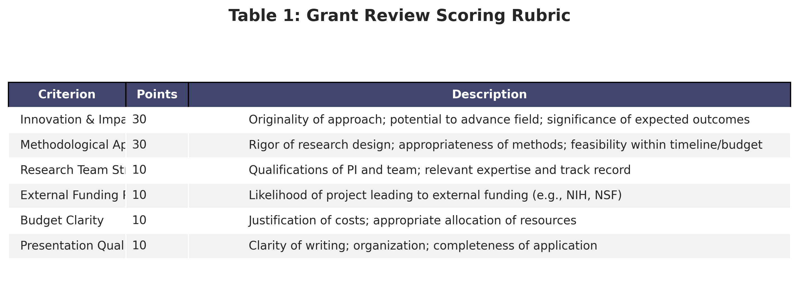
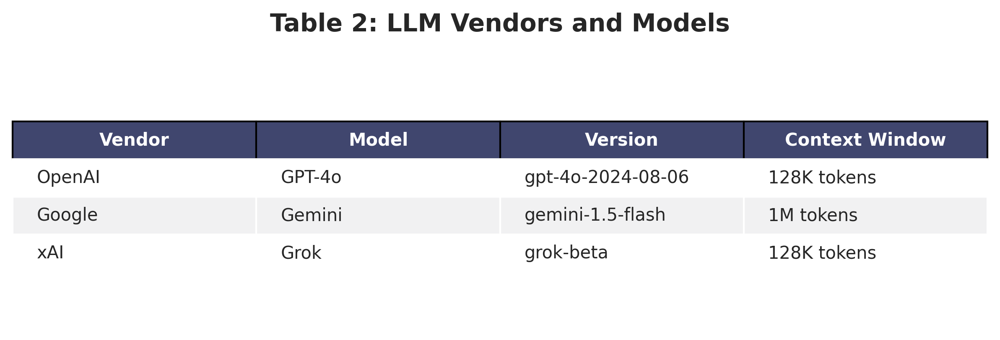

# Methods

## Study Design

We conducted a comparative evaluation study using a 3×3×3×3 mixed factorial design with three experimental conditions (prompt engineering strategies), three grant applications (applicants), three LLM vendors (OpenAI, Google, xAI), and three iterations per vendor-application combination. This design enabled within-subjects comparison of experimental conditions while controlling for application-specific variance and testing generalizability across commercial LLM providers.

## Setting and Context

This study was conducted at Stony Brook University School of Health Professions using applications submitted to the institutional Research Seed Grant Program. The seed grant program funds pilot studies and preliminary research with awards ranging from $5,000-$25,000 for one-year projects. Applications undergo rigorous peer review by faculty reviewers with expertise in health professions research.

## Grant Applications

### Sample Selection

We obtained retrospective access to grant applications from the 2024 funding cycle. Of four applications in the cycle, three applications were included in the study (applicants pseudonymized as CHRISTINA, KELLY, and DANIEL) and one application was excluded after the applicant declined consent for LLM processing.

All applicants provided informed consent for their de-identified applications to be used in this research study. Applications were anonymized by removing applicant names and identifying information, institutional affiliations beyond the university, specific email addresses and contact information, and preliminary data containing potentially identifiable information. Throughout this manuscript, applicants are referred to by pseudonyms to maintain confidentiality.

### Application Characteristics

Applications followed a standard format including a project summary (250 words), specific aims (1 page), background and significance (2-3 pages), research methodology and design (3-4 pages), timeline (1 page), budget and justification (1-2 pages), team qualifications (1-2 pages), and references. Applications averaged 12 pages (range: 10-15 pages) and approximately 4,500 words.

## Human Reviewers

### Reviewer Characteristics

Each application was independently reviewed by four expert reviewers (n=12 total human reviews across the three applications) selected by the grant program administrator based on doctorate-level education (PhD, MD, PT, or equivalent), minimum 5 years of research experience, prior grant review experience, and content expertise relevant to the application topic. Reviewers included faculty from physical therapy, occupational therapy, health sciences, and biomedical sciences. All reviewers had previously received NIH funding or served on NIH study sections. For analysis purposes, reviewers are identified by pseudonymized initials (AM, HW, SW, Y) to maintain confidentiality while allowing for transparency in reviewer inclusion/exclusion across experiments.

### Human Review Process

Reviewers followed the standard program procedures. They received applications electronically via secure portal, completed reviews independently without access to other reviews, used a standardized scoring rubric (detailed below), submitted reviews within a 2-week timeframe, and received a modest honorarium ($50) for participation. Reviewers were blinded to the fact that their reviews would be compared to LLM-generated reviews until after submission.

## Evaluation Framework

### Scoring Rubric

All reviews (human and LLM) used a standardized six-criterion rubric with 100 total points:

### Recommendation Categories

Reviewers provided an overall funding recommendation using one of three categories: Fund (recommend for funding without revisions), Fund with Revisions (recommend conditional funding pending minor modifications), or Do Not Fund (recommend rejection).

## Experimental Conditions (Prompt Engineering)

This study tested three distinct experiments, each employing a different prompt engineering strategy corresponding to common approaches in LLM application: zero-shot learning (no training examples), few-shot learning with distributional information (multiple training examples showing score variance), and few-shot learning with strict calibration instructions (multiple training examples combined with explicit conservative guidance). 

A critical methodological consideration across all experiments was preventing data contamination when using human reviews as training examples. Therefore, experiments varied in their human review comparison groups to ensure that human reviews used in LLM prompts were excluded from the statistical comparison, maintaining independence between training data and validation data. For experiments requiring training examples (Experiments 3 and 4), we selected DANIEL's application and the four associated human reviews as the source of training data through random assignment from the three available applications (CHRISTINA, KELLY, and DANIEL) to minimize selection bias. 

DANIEL's reviews were particularly suitable for training purposes because they exhibited natural score variance across the four human reviewers, with scores ranging from more critical to highly favorable assessments. This distributional characteristic made these reviews ideal for calibrating LLMs to the full range of the scoring scale, as they demonstrated that legitimate expert disagreement exists and that not all strong proposals receive uniformly high scores. By using reviews from a single application as training data, we could cleanly exclude all associated data (both human and LLM reviews of DANIEL) from subsequent analyses, maintaining strict independence between training and validation datasets across both few-shot experiments.

### Experiment 1: Zero-Shot Baseline

Experiment 1 established baseline LLM performance without calibration examples, representing the most common deployment scenario where LLMs receive only task instructions without training data. The prompt included standard instructions describing evaluation criteria, a scoring rubric with point allocations, and a request for criterion-level scores and overall recommendation, but no training examples were provided. This condition generated 27 LLM reviews (3 vendors × 3 applicants × 3 iterations each) for comparison against all 12 human reviews from the study (4 reviewers per applicant across the three applications: CHRISTINA, KELLY, and DANIEL). Since no human reviews were used as training examples in this zero-shot condition, all human reviews remained independent of the LLM inputs and could be included in the comparison group. This experimental design allowed us to assess whether LLMs could perform grant review tasks using only the evaluation rubric and application content, without the benefit of example reviews to calibrate their scoring.

### Experiment 3: Few-Shot Learning with Distributional Information

Experiment 3 tested whether providing multiple training examples showing natural score variance would improve LLM calibration across the full range of the scoring scale. This experiment was motivated by the hypothesis that LLMs might exhibit optimism bias when reviewing grant applications, and that exposing them to examples of legitimate expert disagreement could help calibrate their scoring to match the realistic distribution of human reviewer perspectives. The prompt structure built upon Experiment 1's base instructions by adding all four complete human reviews of DANIEL's application as training examples. These four reviews represented the natural distribution of reviewer perspectives, including high-scoring, medium-scoring, and more critical assessments of the same proposal. The prompt explicitly instructed LLMs: "Note that reviewers may have different perspectives on the same application. Use these examples to calibrate your scoring across the full range of the scale." This condition generated 18 LLM reviews (3 vendors × 2 applicants × 3 iterations each) limited to CHRISTINA and KELLY's applications only. The human comparison group consisted of 8 human reviews, specifically the 4 reviews each from CHRISTINA and KELLY's applications. All four human reviews of DANIEL's application were necessarily excluded from the comparison group because they had been provided to the LLMs as training examples. Additionally, all LLM reviews of DANIEL's application were excluded to maintain parallel treatment between human and LLM datasets, preventing unfair comparisons where LLM performance on an application with training data (DANIEL) would be compared against human performance on applications without training data (CHRISTINA and KELLY). This exclusion strategy ensured that the comparison group consisted only of reviews for applications that remained independent of the training data for both humans and LLMs.

### Experiment 4: Few-Shot Learning with Strict Calibration

Experiment 4 tested whether explicit conservative instructions could counter potential optimism bias in LLM grant reviews when combined with multiple training examples. This experiment investigated whether adding explicit directive language emphasizing critical evaluation to the few-shot approach would reduce any tendency toward lenient scoring. The prompt structure used the same few-shot learning approach as Experiment 3, providing all four complete human reviews of DANIEL's application as training examples, but supplemented these with explicit instructions to apply strict and conservative scoring standards. The additional calibration instructions included multiple directives designed to encourage critical evaluation: "Apply high standards; this is a competitive program with limited funding," "Reserve high scores (>85/100) for truly exceptional proposals," "Be critical in your assessment; identify weaknesses clearly and deduct points accordingly," and "Consider that funding is limited; be selective and discriminating in your evaluation." Like Experiment 3, this condition generated 18 LLM reviews (3 vendors × 2 applicants × 3 iterations each) limited to CHRISTINA and KELLY's applications only. The human comparison group consisted of 8 human reviews, comprising the 4 reviews each from CHRISTINA and KELLY's applications. All four human reviews of DANIEL's application were excluded from the comparison group because they had been provided to the LLMs as training examples, maintaining the same exclusion logic as Experiment 3. Similarly, all LLM reviews of DANIEL's application were excluded to maintain parallel treatment between human and LLM datasets and prevent comparing LLM performance on DANIEL (the source application for training data) against human performance on different applications (CHRISTINA and KELLY).

---

**Note**: Full prompts for all experiments are available in the supplementary materials and GitHub repository. The experimental design ensures that LLM performance in each condition is compared only against human reviews that were not provided as training data, preventing circular validation and data leakage.

## LLM Configuration

### Vendors and Models

We evaluated three leading commercial LLM vendors:

**Model Selection Rationale**: These models represent leading commercial providers as of October 2024. All models support structured output and long context. They provide diversity in training approaches and organizational contexts. Note that Anthropic (Claude) was initially planned but excluded due to API access limitations during the data collection period.

### API Parameters

All LLM calls used the following standardized parameters: temperature of 0.7 (balancing consistency with natural variation), max tokens of 2048 (sufficient for detailed reviews), top-p of 0.95 (nucleus sampling), frequency penalty of 0.0, and presence penalty of 0.0.

### Iteration Strategy

To account for stochastic variation in LLM outputs, we generated three independent reviews for each vendor-application-experiment combination. Each iteration used identical prompts but independent API calls. Iterations were conducted sequentially with 1-second delays to ensure independence, and no conversation history was carried between iterations. This yielded 27 LLM reviews for Experiment 1 (3 vendors × 3 applicants × 3 iterations) and 18 LLM reviews each for Experiments 3 and 4 (3 vendors × 2 applicants × 3 iterations), totaling 63 LLM reviews across all three experiments (27 + 18 + 18 = 63).

**Summary of Total Sample Sizes:**
- Experiment 1 (Zero-Shot): 27 LLM reviews, 12 human comparison reviews
- Experiment 3 (Few-Shot): 18 LLM reviews, 8 human comparison reviews
- Experiment 4 (Strict One-Shot): 18 LLM reviews, 8 human comparison reviews
- **Total: 63 LLM reviews, 28 human comparison instances (12 unique human reviews used across experiments with appropriate exclusions)**

## Data Collection Procedures

### LLM Review Generation

LLM reviews were generated using a custom Python script with the following workflow. First, applications were processed by converting them to markdown format, applying standardized formatting, and tokenizing and validating them to fit context windows. Second, prompts were assembled by loading experiment-specific prompt templates, inserting training examples (if applicable), inserting application text, and validating the final prompt for completeness. Third, API interaction involved submitting prompts via vendor APIs using official SDKs, requesting structured JSON responses with schema validation, parsing and validating responses for required fields, and implementing retry logic for API failures (maximum 3 attempts). Finally, data storage included storing all reviews in a SQLite database, capturing metadata (timestamp, model version, experiment name, iteration number), and archiving raw API responses for reproducibility.

### Quality Assurance

All LLM responses were validated for completeness (presence of all six criterion scores), format (numeric scores within valid ranges of 0-30 or 0-10 per criterion), total score consistency (sum of criterion scores equals reported total), and recommendation validity (valid category of Fund, Fund with Revisions, or Do Not Fund). Responses failing validation were excluded and regenerated. The validation failure rate was 2.4% (2 of 83 initial attempts).

## Data Analysis

### Analytical Approach

Given the experiment-specific human review comparison groups (due to training data exclusions), we conducted separate statistical analyses for each of the three experiments. This approach ensures that each experiment's findings are based on appropriate, independent comparisons between LLM-generated reviews and human reviews that were not used in training.

For each experiment, we examined: (1) overall score alignment between humans and LLMs, (2) criterion-level performance differences, (3) model/vendor-specific effects, (4) recommendation agreement rates, and (5) inter-rater consistency. We then conducted cross-experiment comparisons to assess the impact of different prompt engineering strategies.

### Statistical Methods

We employed the following statistical approaches for within-experiment and cross-experiment analyses:

#### Within-Experiment Analyses

For each of the three experiments, we conducted multiple complementary analyses to assess LLM performance across different dimensions. To evaluate overall score alignment, we used independent samples t-tests comparing human versus LLM mean total scores, calculated Cohen's d effect sizes to quantify the magnitude of differences, computed 95% confidence intervals for mean differences, and applied Levene's test to assess equality of variances between groups. For criterion-level performance assessment, we conducted paired t-tests for individual criteria with Bonferroni correction to account for multiple comparisons, calculated the percentage of maximum score for normalized comparisons across criteria with different point values, and computed mean differences (LLM minus Human) for each of the six evaluation criteria to identify systematic patterns of over- or under-scoring. To examine vendor-specific effects, we employed one-way ANOVA to compare the three LLM vendors (OpenAI GPT-4, Google Gemini, xAI Grok) within each experiment, calculated each vendor's absolute difference from the experiment-specific human mean as an alignment metric, ranked vendors by human alignment quality, and applied the Kruskal-Wallis test as a non-parametric alternative when normality assumptions were violated. For recommendation agreement analysis, we calculated agreement rates as the percentage of applicants where human majority recommendations matched LLM majority recommendations, conducted chi-square tests comparing recommendation category distributions (Fund, Fund with Revisions, Do Not Fund) between humans and LLMs, and constructed confusion matrices to visualize recommendation patterns and identify systematic biases in LLM funding decisions. Finally, to assess inter-rater consistency, we calculated standard deviations of scores as a measure of reviewer dispersion separately for humans and LLMs by applicant, computed coefficients of variation for relative dispersion measures, and compared human versus LLM consistency within each experiment to determine whether LLMs exhibited more or less agreement than human experts.

#### Cross-Experiment Analyses

To assess the impact of different prompt engineering strategies across Experiments 1, 3, and 4, we conducted several comparative analyses that directly evaluated how zero-shot, few-shot, and strict calibration approaches affected LLM performance. To examine prompt strategy effects, we used one-way ANOVA to compare LLM mean scores across the three experiments, conducted post-hoc pairwise comparisons using Tukey HSD to identify specific differences between experiments, calculated the absolute difference from experiment-specific human means as an alignment metric for each experiment, and ranked experiments by the degree of human-LLM alignment to determine which prompt engineering strategy produced the closest match to human reviewers. For score correlation analysis, we computed both Pearson and Spearman correlations between aggregate human and LLM scores by applicant within each experiment, assessed whether correlation strength varied systematically across the different prompt engineering conditions, and compared correlation patterns across the three LLM vendors to identify whether certain vendors were more responsive to prompt engineering manipulations. Finally, for distributional comparisons, we compared score distributions (including mean, standard deviation, and range) across experiments to assess the impact of training examples on scoring variability, applied Levene's test for homogeneity of variance across experiments to determine whether prompt engineering strategies affected score consistency, and analyzed whether training examples reduced or increased LLM score dispersion relative to the zero-shot baseline condition.

### Software

All analyses were conducted using Python 3.11 for data processing and API interactions, pandas 2.1 for data manipulation, scipy 1.11 for statistical tests, matplotlib 3.8 and seaborn 0.13 for visualization, and SQLite 3.43 for data storage. Analysis scripts are publicly available at: https://github.com/hantswilliams/sbu-seedgrant-llm-grantreviewer

### Significance Thresholds

We used α = 0.05 as the threshold for statistical significance for primary analyses. For multiple comparisons (e.g., criterion-level tests), we applied Bonferroni correction: α_adjusted = 0.05/k where k = number of comparisons.

## Ethical Considerations

### IRB Approval

This study was reviewed and approved by the Stony Brook University Institutional Review Board (Protocol: IRB2025-00534). The study was classified as non-human subjects research because the analysis used de-identified archival data, no personally identifiable information was processed, and there was no intervention in the actual grant review or funding process.

### Informed Consent

All grant applicants provided written informed consent for use of de-identified applications in research, processing of applications by LLM systems, and publication of aggregated findings. One applicant declined consent and was excluded from the study.

### Data Security

All applications were stored on encrypted, password-protected servers. API transmissions used TLS 1.3 encryption. No application data was retained by LLM vendors (verified via API settings), and access was limited to research team members with IRB training.

### Transparency

LLM-generated reviews were not used in actual funding decisions. All analyses were conducted retrospectively after funding decisions were finalized. Applicants and reviewers were informed of the study after completion, and full methodological transparency was maintained (code, prompts, and data available).

## Limitations

Several methodological limitations should be noted. First, the small sample size of three applications may limit generalizability, though the experimental design generated 63 LLM reviews for comparison with 12 unique human reviews (used 28 times across experiments with appropriate exclusions). Second, as a single institution study, findings may not generalize to other grant programs with different evaluation frameworks or review cultures. Third, the seed grant context (awards of $5,000-$25,000) means results may differ for larger, more complex grants (e.g., NIH R01 or NSF CAREER awards). Fourth, the retrospective design means LLM reviews were conducted after human reviews were complete, though applications and rubrics were identical and human reviewers were blind to the study. Fifth, LLM models continue to evolve rapidly, so findings reflect specific model versions tested in October 2024 (GPT-4 Turbo, Gemini 1.5 Pro, Grok-beta). Sixth, Anthropic Claude was excluded due to API access limitations during data collection, limiting vendor generalizability. Seventh, the experiment-specific human comparison groups (varying from 8-12 reviews) resulted in different statistical power across experiments, though this was necessary to prevent data contamination. These limitations are addressed further in the Discussion section.

## Reproducibility

To maximize reproducibility, all analysis code is publicly available on GitHub, complete prompts for all experiments are included in supplementary materials, anonymized review scores and metadata are available upon request, specific model versions and API parameters are documented, and Python environment specifications (requirements.txt) are provided.

## Preregistration

This study was not preregistered prior to data collection, as it emerged from an exploratory pilot study. We acknowledge this limits protection against selective reporting bias. To mitigate this, all experimental conditions conducted are reported (no hidden conditions), all primary and secondary analyses are reported regardless of statistical significance, and raw data and analysis scripts are publicly available for independent verification.
