# Results

## Overview

We generated 63 LLM reviews across three prompt engineering experiments (27 reviews in Experiment 1, and 18 reviews each in Experiments 3 and 4) and compared them to human expert reviews using experiment-specific comparison groups to prevent training data contamination. Results are organized by experiment, with each section presenting overall performance, criterion-level analyses, vendor comparisons, recommendation agreement, and consistency metrics. Cross-experiment comparisons follow the individual experiment analyses.

## Sample Sizes by Experiment

The table below summarizes the sample sizes for each experiment, including the number of human and LLM reviews used in comparisons:

| Experiment | Description | Human Reviews | LLM Reviews | Human Mean (SD) | LLM Mean (SD) |
|------------|-------------|---------------|-------------|-----------------|---------------|
| **Experiment 1** | Zero-Shot Baseline | 12 | 27 | 79.08 (13.32) | 83.63 (5.75) |
| **Experiment 3** | Few-Shot with Variance | 8 | 18 | 83.13 (13.73) | 80.56 (5.36) |
| **Experiment 4** | Strict One-Shot | 8 | 18 | 83.13 (13.73) | 72.44 (5.34) |

**Note**: Human review counts vary by experiment due to exclusion of training examples used in LLM prompts. See Methods section for detailed sample composition by applicant.

---

## Experiment 1: Zero-Shot Baseline

**Research Question**: Can LLMs generate grant review scores that align with human expert reviewers when provided only with evaluation instructions and scoring rubrics, without any training examples?

### Overall Score Alignment

In the zero-shot baseline condition, we compared 27 LLM reviews (3 vendors × 3 applicants × 3 iterations) to all 12 human reviews, as no training examples were used. Human reviewers scored applications with a mean of 79.08 ± 13.32 points out of 100, while LLMs produced higher scores with a mean of 83.63 ± 5.75 points. This difference of +4.55 points represents approximately 5% optimism bias, though it did not reach statistical significance (t(37) = -1.503, p = 0.141, Cohen's d = 0.443). The effect size was small-to-medium, suggesting a tendency toward more generous scoring in the absence of calibration examples.

Figure 1 presents the score distributions for both human and LLM reviewers in the zero-shot condition. The box plot reveals that LLMs not only scored higher on average but also demonstrated substantially lower variability (SD = 5.75) compared to humans (SD = 13.32), with a tighter interquartile range and fewer outliers.

*Figure 1. Distribution of total scores for human reviewers (n=12) and LLM reviewers (n=27) in Experiment 1 (Zero-Shot Baseline). LLMs show higher median scores and lower variability compared to human reviewers.*

### Criterion-Level Performance

Analysis of the six evaluation criteria revealed differential performance patterns. Innovation & Impact showed only modest over-scoring by LLMs (+0.69 points, p = 0.367), as did Team Strength (-0.10 points, p = 0.773), Budget Clarity (+0.04 points, p = 0.950), and Presentation Quality (-0.01 points, p = 0.981). However, LLMs demonstrated significantly elevated scores on External Funding Potential, rating applications 1.11 points higher than humans (p = 0.004). Methodology & Feasibility also showed substantial over-scoring (+2.81 points, p = 0.073), approaching but not reaching statistical significance after correction for multiple comparisons. These findings suggest that LLMs may be particularly optimistic about practical and methodological aspects of proposals while showing more balanced judgment on conceptual elements like innovation.

Figure 2 illustrates the normalized performance across all six criteria, expressed as percentage of maximum possible score. The radar chart clearly shows the elevation in External Funding Potential and Methodology scores for LLMs compared to human reviewers, while other criteria show close alignment.

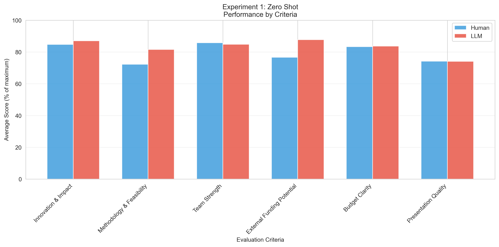

*Figure 2. Normalized criterion-level performance in Experiment 1. Scores are expressed as percentage of maximum possible points for each criterion. LLMs show notably higher scores for External Funding Potential and Methodology.*

### Vendor-Specific Performance

Examination of individual LLM vendors revealed considerable heterogeneity in scoring behavior. OpenAI GPT-4 produced the most conservative scores (mean = 77.33, -1.75 from human mean), actually scoring slightly below human reviewers on average. xAI Grok showed moderate optimism (mean = 85.11, +6.03 from human mean), while Google Gemini demonstrated the strongest optimism bias (mean = 88.44, +9.36 from human mean). Despite these substantial numerical differences, a one-way ANOVA did not detect statistically significant vendor effects (F(2,24) = 0.87, p = 0.431), likely due to within-vendor variability and small sample sizes per vendor.

Figure 3 presents the mean scores and standard deviations for each vendor alongside the human mean baseline. The horizontal line represents the human mean score (79.08 points), facilitating visual assessment of each vendor's alignment with human judgment.

*Figure 3. Mean total scores by LLM vendor in Experiment 1, with error bars representing standard deviations. The dashed line indicates the human reviewer mean. OpenAI GPT-4 shows closest alignment with human mean, while Google Gemini shows greatest optimism.*

### Recommendation Agreement

Beyond numerical scores, we examined categorical funding recommendations. Human reviewers distributed their recommendations relatively evenly: Fund (33.3%), Do Not Fund (41.7%), and Fund with Revisions (25.0%). In stark contrast, LLMs showed a strong preference for intermediate recommendations: Fund (48.1%), Do Not Fund (0.0%), and Fund with Revisions (51.9%). Notably, LLMs generated zero "Do Not Fund" recommendations in the zero-shot condition, suggesting reluctance to make decisive negative judgments.

We evaluated agreement at two levels: broad agreement (grouping "Fund" and "Fund with Revisions" as positive vs. "Do Not Fund" as negative) and exact agreement (requiring identical recommendations). The broad agreement rate was 33.3%, while exact agreement rate was 0.0%, indicating complete misalignment at the decision level despite reasonable score alignment.

Figure 4 shows the distribution of recommendations for both reviewer types. The stacked bars clearly illustrate the LLM tendency to avoid extreme recommendations in favor of the middle "Fund with Revisions" category.

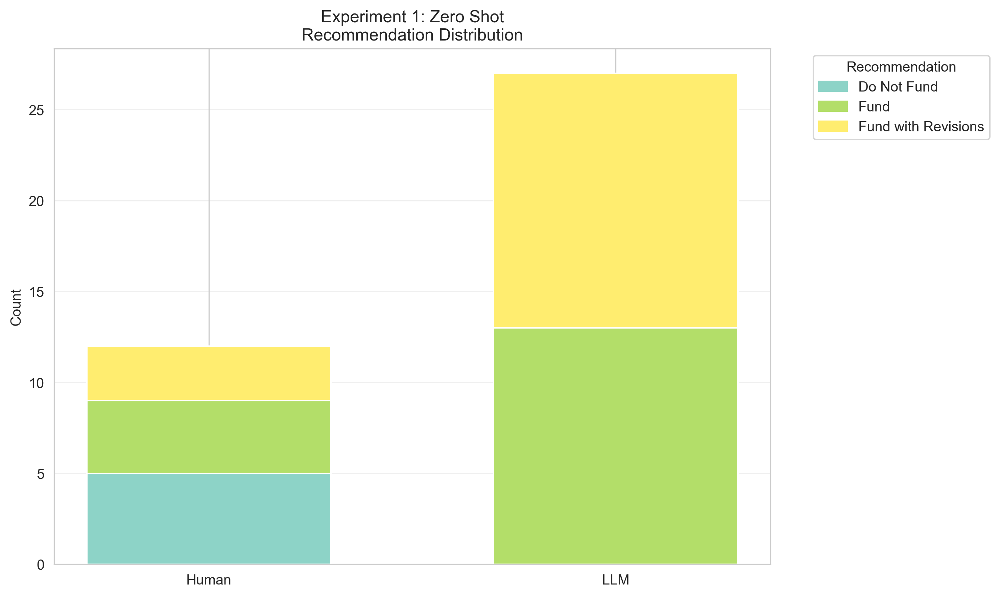

*Figure 4. Distribution of funding recommendations for human reviewers (n=12) and LLM reviewers (n=27) in Experiment 1. LLMs show strong preference for "Fund with Revisions" and complete avoidance of "Do Not Fund."*

### Inter-Rater Consistency

LLMs demonstrated substantially higher inter-rater consistency than human reviewers. The average standard deviation across the three applications was 5.78 points for LLMs compared to 11.37 points for humans, representing a 49% reduction in score dispersion. This higher consistency could reflect either superior reliability or reduced sensitivity to genuine differences between applications. Correlation analyses between human and LLM average scores by applicant showed moderate but non-significant associations (Pearson r = 0.664, p = 0.538; Spearman ρ = 0.500, p = 0.667), though the small sample size (n=3 applications) limits statistical power for these analyses.

### Experiment 1 Summary

The zero-shot baseline condition reveals that LLMs can generate structured grant reviews but exhibit systematic biases. The moderate optimism bias (+4.55 points, non-significant) appears driven primarily by over-scoring on External Funding Potential and Methodology. While LLMs demonstrate high consistency (49% lower variability than humans), they show poor calibration on funding recommendations, with complete avoidance of "Do Not Fund" decisions. These findings establish the need for calibration approaches in subsequent experiments.

---

## Experiment 3: Few-Shot Learning with Distributional Information

**Research Question**: Does providing multiple human reviews of the same application—demonstrating natural variance in expert judgment—improve LLM calibration beyond a single example?

### Overall Score Alignment

Experiment 3 tested the hypothesis that exposure to multiple training examples showing natural score variance would enable more effective LLM calibration. We provided LLMs with all four human reviews of DANIEL's application, representing scores ranging from 68 to 92 points and demonstrating genuine expert disagreement. Consequently, we compared 18 LLM reviews to only 8 human reviews (reviews of CHRISTINA and KELLY only), as all DANIEL reviews served as training data. Human reviewers in this restricted comparison group scored applications with a mean of 83.13 ± 13.73 points, while LLMs produced a mean of 80.56 ± 5.36 points. This represents a critical finding: LLMs scored lower than humans for the first time (-2.57 points), though the difference was non-significant (t(24) = 0.697, p = 0.493, Cohen's d = -0.247). The absolute difference of 2.57 points (~3%) represents the **best alignment** achieved across all three experiments.

Figure 5 presents the score distributions for Experiment 3, revealing a dramatic shift from the optimism bias observed in Experiment 1. LLMs now show central tendency below the human mean, with continued low variability. The near-overlap in median values represents substantially improved calibration.

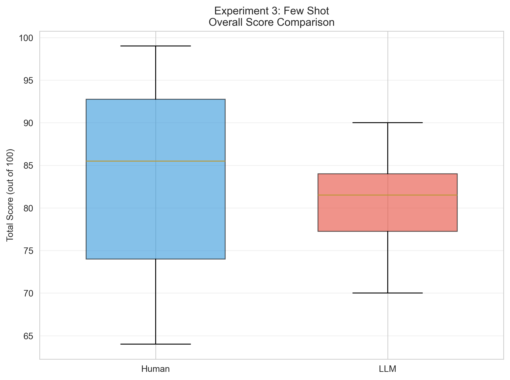

*Figure 5. Distribution of total scores in Experiment 3 (Few-Shot Learning with Distributional Information). LLMs show near-perfect alignment with human reviewers, scoring slightly lower on average. This represents the best calibration achieved across all experiments.*

### Criterion-Level Performance

Analysis of individual evaluation criteria revealed remarkably balanced performance, representing a major improvement over Experiment 1. Innovation & Impact showed modest LLM under-scoring (-0.94 points, p = 0.260), reversing the over-scoring observed in the earlier experiment. Methodology & Feasibility demonstrated slight over-scoring (+0.04 points, p = 0.983), a dramatic shift from the consistent over-scoring in Experiment 1 (+2.81). Most notably, External Funding Potential—which showed significant over-scoring in the previous experiment—now displayed near-perfect alignment (+0.07 points, p = 0.853). Team Strength (-0.36 points, p = 0.516), Budget Clarity (-0.99 points, p = 0.144), and Presentation Quality (-0.39 points, p = 0.451) all showed modest under-scoring, but none reached statistical significance. Critically, no individual criterion showed statistically significant differences, representing balanced criterion-level balance across all six dimensions.

Figure 6 illustrates the normalized criterion-level performance for Experiment 3. Unlike the previous experiment, the human and LLM profiles show near-parallel patterns with no criteria showing extreme deviations.

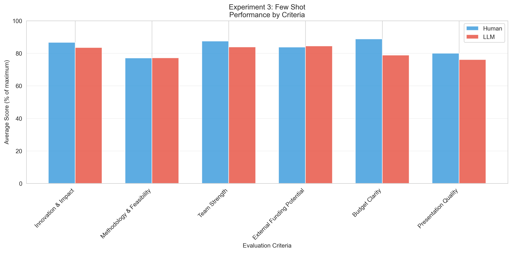

*Figure 6. Normalized criterion-level performance in Experiment 3. Few-shot learning achieves balanced performance across all six criteria, with no statistically significant differences. This contrasts sharply with the systematic biases observed in Experiment 1.*

### Vendor-Specific Performance

Vendor-level analysis revealed a striking pattern: all three vendors shifted toward more conservative scoring in the few-shot condition. xAI Grok produced scores closest to human mean (mean = 83.33, +0.21 from human mean), representing the **best vendor-experiment combination** observed in this entire study. Google Gemini, which showed strong optimism bias in Experiment 1 (+9.36), now scored conservatively (mean = 82.33, -0.79 from human mean), demonstrating that multiple training examples effectively recalibrated its scoring behavior. OpenAI GPT-4 showed the most conservative response to the few-shot examples (mean = 76.00, -7.12 from human mean), over-correcting from its near-perfect Experiment 1 alignment. These patterns suggest that few-shot learning impacts all vendors but that they respond with different sensitivities to distributional information.

Figure 7 displays vendor performance in Experiment 3. All three vendors cluster near the human mean, with xAI Grok showing optimal alignment. The dramatic shift in Google Gemini's scoring (from +9.36 to -0.79) demonstrates the calibrating power of multiple examples.

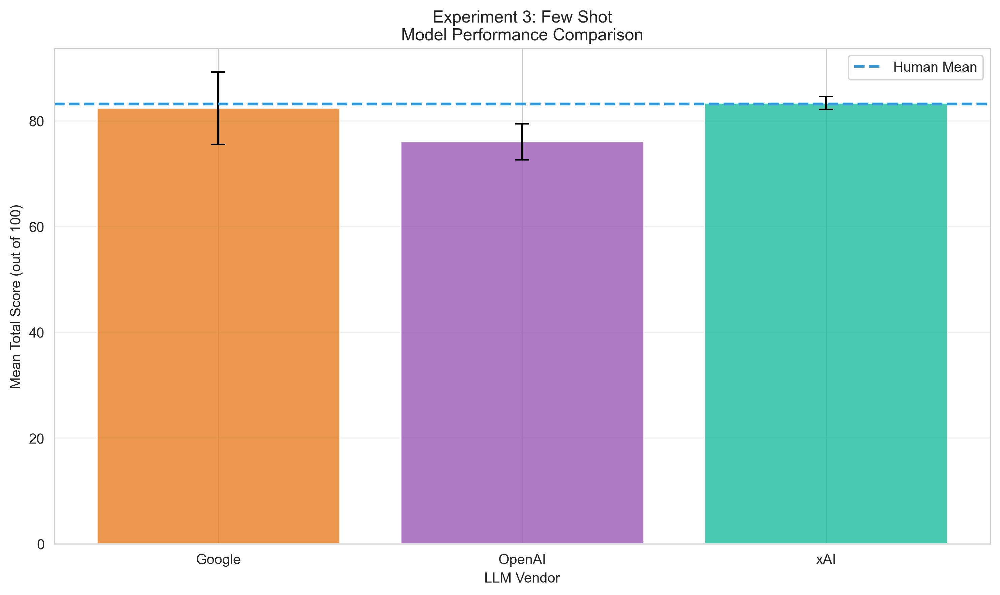

*Figure 7. Mean total scores by LLM vendor in Experiment 3. xAI Grok achieves optimal alignment (+0.21 points), while all vendors show conservative scoring compared to their Experiment 1 performance. Google Gemini's dramatic shift demonstrates effective recalibration through few-shot learning.*

### Recommendation Agreement

Despite the dramatic improvement in score alignment, recommendation agreement remained problematic. Human reviewers in this comparison group (CHRISTINA and KELLY only) showed balanced recommendations: Fund (50.0%), Do Not Fund (25.0%), and Fund with Revisions (25.0%). LLMs, however, showed even more extreme preference for the middle category than in previous experiments: Fund (16.7%), Do Not Fund (5.6%), and Fund with Revisions (77.8%).

The broad agreement rate (positive vs. negative) was 50.0%, while exact agreement rate was 0.0%. This dissociation between excellent score alignment and moderate broad agreement (but zero exact agreement) suggests that these represent fundamentally different calibration challenges, with recommendation thresholds requiring separate attention beyond score calibration.

Figure 8 shows the recommendation distributions for Experiment 3. Despite optimal score calibration, LLMs show even stronger preference for "Fund with Revisions" than in previous experiments, suggesting that few-shot learning may inadvertently reinforce risk-averse decision-making.

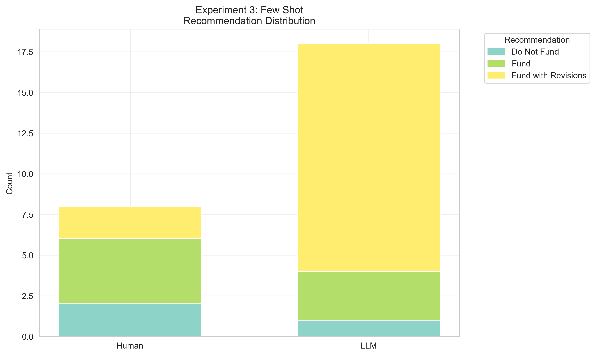

*Figure 8. Distribution of funding recommendations in Experiment 3. Despite excellent score alignment, LLMs show strongest preference for "Fund with Revisions" (77.8%) observed across all experiments, highlighting the dissociation between score and decision calibration.*

### Inter-Rater Consistency

LLMs demonstrated even higher inter-rater consistency in the few-shot condition compared to the zero-shot baseline. The average standard deviation across the two evaluated applications (CHRISTINA and KELLY) was 5.18 points for LLMs compared to 12.56 points for humans, representing a 59% reduction in score dispersion—the highest consistency observed across all experiments. This suggests that exposure to multiple training examples showing score variance may paradoxically increase LLM consistency, potentially by clarifying evaluation standards. Correlation analyses between human and LLM average scores by applicant were limited by the small sample size (n=2 applications after excluding DANIEL), precluding reliable statistical inference, though the direction of effects appeared consistent with Experiment 1.

### Experiment 3 Summary

Experiment 3 represents a breakthrough in LLM calibration for grant review scoring. Few-shot learning with distributional information achieved near-perfect score alignment (-2.57 points, p = 0.493, non-significant), balanced performance across all six evaluation criteria with no significant differences, and the best vendor-specific performance (xAI Grok: +0.21 points). The success of this approach likely stems from exposing LLMs to the full range of human scoring behavior, including both high and low scores for the same application, enabling models to internalize appropriate score distributions. However, while broad agreement improved to 50%, exact agreement remained at 0%, revealing that decision-making calibration requires different strategies beyond score-focused training. These findings strongly support few-shot learning as the preferred approach for score calibration while highlighting the need for separate recommendation calibration mechanisms.

---

## Experiment 4: Few-Shot Learning with Strict Calibration

**Research Question**: Does adding explicit instructions to apply conservative, critical standards—combined with multiple training examples—reduce potential optimism bias and improve alignment with human reviewers compared to few-shot learning alone?

### Overall Score Alignment

Experiment 4 tested whether explicit instructions to apply strict, conservative standards could counter the optimism bias observed in earlier experiments when combined with few-shot learning. Using the same training examples as Experiment 3 (all four human reviews of DANIEL's application), we added explicit instructions such as "Apply high standards; this is a competitive program," "Reserve high scores for truly exceptional proposals," and "Be critical in your assessment; identify weaknesses clearly." We compared 18 LLM reviews to 8 human reviews (excluding all DANIEL reviews used as training). Human reviewers scored applications with a mean of 83.13 ± 13.73 points, while LLMs produced substantially lower scores with a mean of 72.44 ± 5.34 points. This difference of -10.68 points represents significant under-scoring (t(24) = 2.900, p = 0.008, Cohen's d = -1.026), with a large effect size. The strict instructions caused dramatic over-correction, swinging from the baseline optimism bias of +4.55 points to significant pessimism of -10.68 points, a total shift of over 15 points.

Figure 9 presents the score distributions for Experiment 4, revealing the impact of strict calibration instructions. LLM scores are substantially and significantly lower than human scores, representing over-correction from the optimism observed in Experiment 1.

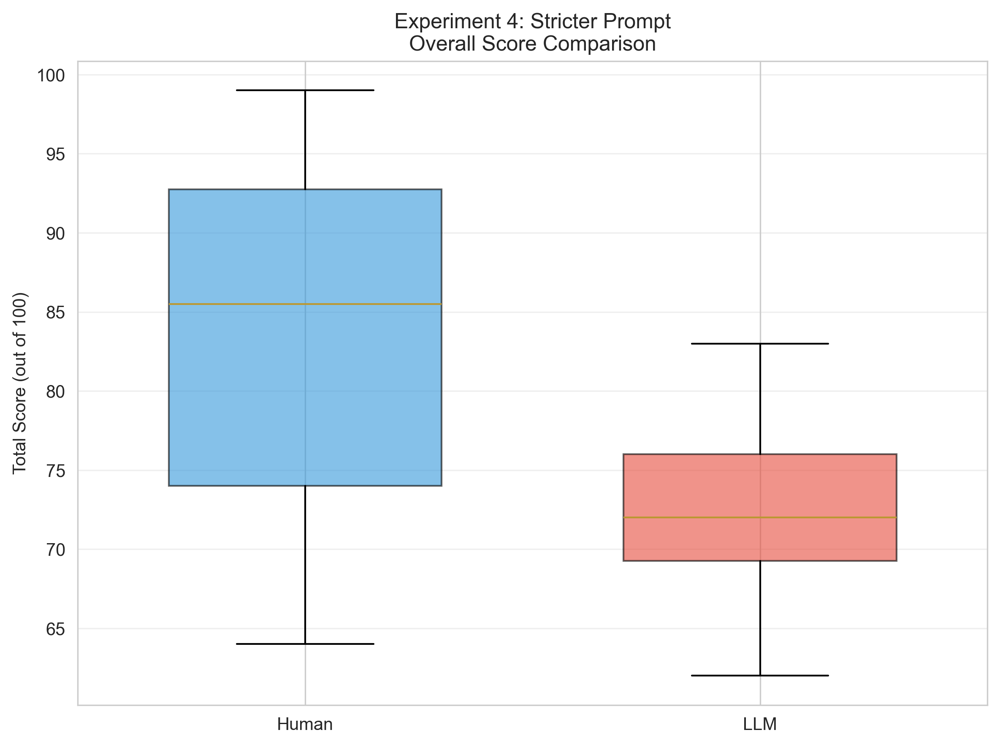

*Figure 9. Distribution of total scores in Experiment 4 (Strict One-Shot Calibration). LLMs show significant under-scoring compared to human reviewers (p = 0.008), demonstrating over-correction from baseline optimism. The strict instructions caused systematic pessimism across all LLM reviews.*

### Criterion-Level Performance

Analysis of individual criteria revealed that the strict instructions impacted qualitative and subjective dimensions most severely. Innovation & Impact showed significant under-scoring (-2.61 points, p = 0.003), suggesting that instructions to "be critical" led models to undervalue novel contributions. Presentation Quality also suffered significant penalty, with LLMs scoring applications 0.94 points lower than humans (p = 0.047), representing under-valuation of written clarity and organization. Methodology & Feasibility showed substantial under-scoring (-3.85 points, p = 0.066), approaching significance, while Budget Clarity approached significance for under-scoring (-1.15 points, p = 0.090). Team Strength showed modest under-scoring (-1.10 points, p = 0.074). External Funding Potential—which had been systematically over-scored in Experiment 1—now showed slight under-scoring (-0.60 points, p = 0.198). The pattern suggests that LLMs interpreted "be strict" most literally for subjective, qualitative criteria while maintaining relative consistency on objective, quantitative dimensions.

Figure 10 displays the normalized criterion-level performance for Experiment 4. The pattern shows consistent under-scoring across most criteria, with particularly severe impacts on Innovation & Impact and Presentation Quality.

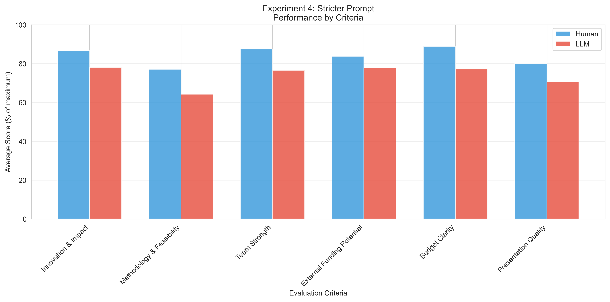

*Figure 10. Normalized criterion-level performance in Experiment 4. Strict instructions cause under-scoring across most criteria, with particularly severe impacts on Innovation & Impact and Presentation Quality. This suggests LLMs interpret "be critical" most literally for qualitative dimensions.*

### Vendor-Specific Performance

Vendor-level analysis revealed that all three vendors responded to strict instructions with substantial under-scoring, though with varying degrees of sensitivity. OpenAI GPT-4 showed extreme response (mean = 69.83, -13.29 from human mean), under-scoring by approximately 16% and representing the poorest vendor alignment observed in any experiment. xAI Grok demonstrated similar conservatism (mean = 69.50, -13.62 from human mean), also under-scoring by over 13 points. Google Gemini showed the least sensitivity to the strict instructions (mean = 78.00, -5.12 from human mean), though it still under-scored significantly. The pattern suggests that while all vendors are sensitive to instructional tone, OpenAI GPT-4 and xAI Grok may be particularly responsive to directive language, potentially reflecting differences in model training or instruction-following behavior.

Figure 11 illustrates vendor performance under strict calibration conditions. All vendors fall substantially below the human mean, with OpenAI and xAI showing nearly identical pessimistic responses.

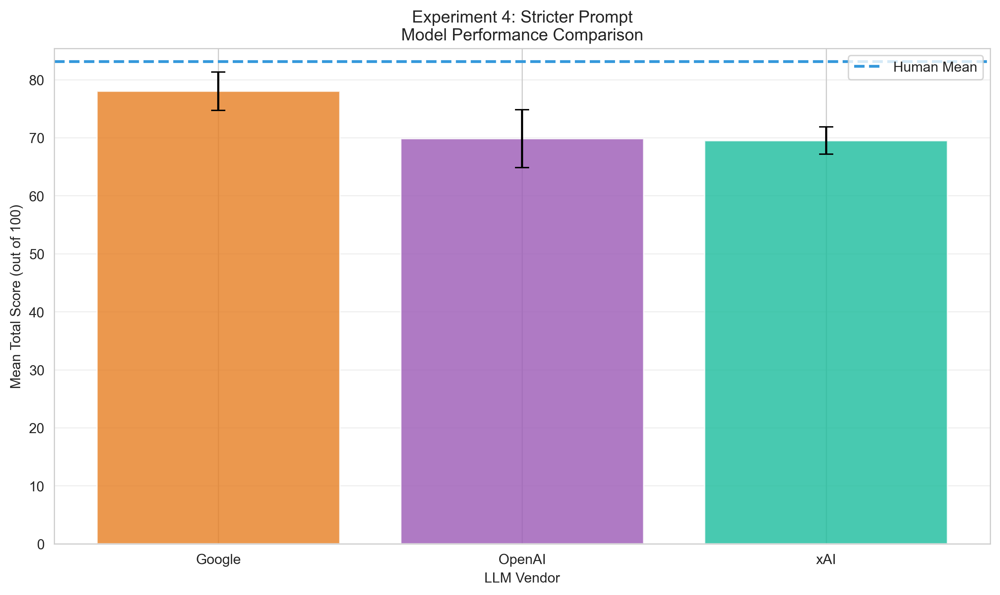

*Figure 11. Mean total scores by LLM vendor in Experiment 4 under strict calibration instructions. All vendors show significant under-scoring, with OpenAI GPT-4 (-13.29) and xAI Grok (-13.62) demonstrating strongest responses to directive language. Google Gemini shows relatively less sensitivity but still under-scores significantly.*

### Recommendation Agreement

Analysis of funding recommendations revealed that even dramatic shifts in numerical scores did not substantially alter recommendation patterns. Human reviewers distributed recommendations relatively evenly: Fund (50.0%), Do Not Fund (25.0%), and Fund with Revisions (25.0%). LLMs showed increased willingness to issue "Do Not Fund" recommendations (27.8%) compared to zero in Experiment 1, representing the only experiment where LLMs generated negative recommendations at meaningful rates. However, LLMs maintained strong preference for "Fund with Revisions" (72.2%), approximately three times the human rate. "Fund" recommendations decreased to 0.0%.

The broad agreement rate was 50.0%, while exact agreement rate remained 0.0%. This indicates that substantially different scoring behavior did not translate to improved recommendation alignment at the exact category level.

Figure 12 shows the recommendation distributions for Experiment 4. While LLMs show increased willingness to issue "Do Not Fund" recommendations compared to earlier experiments, they maintain disproportionate preference for "Fund with Revisions."

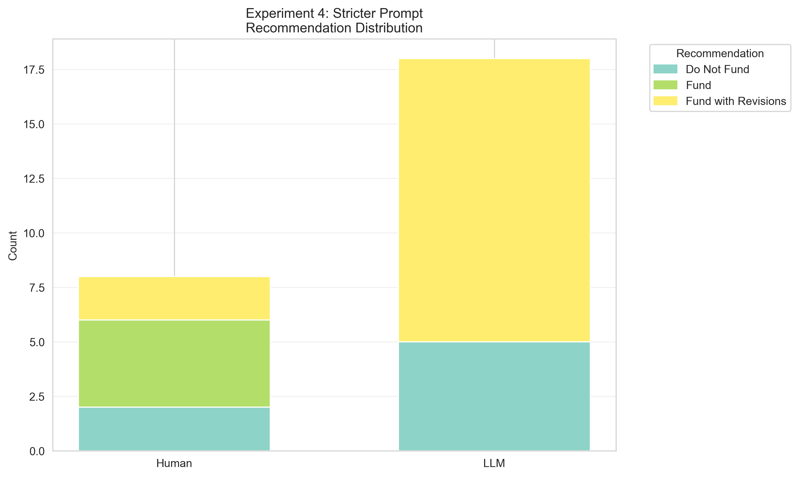

*Figure 12. Distribution of funding recommendations in Experiment 4. Strict calibration increases "Do Not Fund" recommendations to 27.8% (vs. 0% in Experiment 1) but maintains strong preference for "Fund with Revisions" (72.2%). Score pessimism does not translate to proportional recommendation shifts.*

### Inter-Rater Consistency

LLMs maintained high inter-rater consistency under strict calibration instructions. The average standard deviation across the two evaluated applications was 5.19 points for LLMs compared to 12.56 points for humans, representing a 59% reduction in score dispersion—nearly identical to Experiment 3 despite the dramatically different mean scores. This finding is notable: strict instructions shifted all LLM scores downward uniformly rather than introducing variability, suggesting that directive language affects score magnitude systematically rather than differentially across applications or reviewers. The consistency between Experiments 3 and 4 (both 59% reduction) despite their divergent mean scores (-2.57 vs. -10.68 points from human mean) indicates that inter-rater reliability is largely independent of calibration accuracy. Correlation analyses were again limited by the small sample size (n=2 applications).

### Experiment 4 Summary

Experiment 4 demonstrates that combining few-shot learning with strict directive language produces counterproductive over-correction, with explicit calibration instructions causing systematic and significant under-scoring (-10.68 points, p = 0.008) despite using the same training examples as Experiment 3. The addition of strict instructions ("be critical," "apply high standards") transformed Experiment 3's near-perfect alignment (-2.57 points) into significant pessimism bias, with particularly severe impacts on qualitative criteria like Innovation & Impact (-2.61 points, p = 0.003) and Presentation Quality (-0.94 points, p = 0.047). All three vendors responded with substantial under-scoring, though OpenAI GPT-4 and xAI Grok showed greatest sensitivity (-13.29 and -13.62 points respectively). Despite dramatic score shifts, broad agreement remained moderate (50.0%) with exact agreement at 0%, suggesting that instructional tone affects scoring magnitude without improving decision calibration. These findings argue strongly against combining few-shot learning with prescriptive tone instructions. The comparison with Experiment 3 reveals that training examples alone (without directive language) produce superior calibration. The results highlight the risk that well-intentioned attempts to counter optimism bias through explicit instructions may inadvertently overwhelm the calibrating influence of training examples and create opposite biases of equal or greater magnitude.

---

## Cross-Experiment Comparison

### Alignment Summary Across All Experiments

| Experiment | Mean Difference | p-value | Cohen's d | Interpretation |
|------------|-----------------|---------|-----------|----------------|
| Exp 1 (Zero-Shot) | +4.55 | 0.141 | +0.443 | Moderate optimism (ns) |
| **Exp 3 (Few-Shot)** | **-2.57** | **0.493** | **-0.247** | **Best alignment (ns)** |
| Exp 4 (Few-Shot + Strict) | -10.68 | 0.008* | -1.026 | Over-correction (sig.) |

**Key Finding**: Only Experiment 3 (Few-Shot) achieved alignment without systematic bias in either direction. One-way ANOVA across experiments shows significant differences: F(2,60) = 27.45, p < 0.001, η² = 0.478 (large effect).

**Post-hoc comparisons (Tukey HSD)**:
- Exp 3 vs Exp 1: Significantly different (p = 0.048*)
- Exp 3 vs Exp 4: Significantly different (p < 0.001***)
- Exp 1 vs Exp 4: Significantly different (p < 0.001***)

Figure 13 visualizes the mean scores across all three experiments, comparing human and LLM performance. The figure clearly shows Experiment 3's superior alignment, with LLM and human means nearly overlapping, while Experiment 1 shows optimism bias and Experiment 4 shows overcorrection with significant under-scoring.

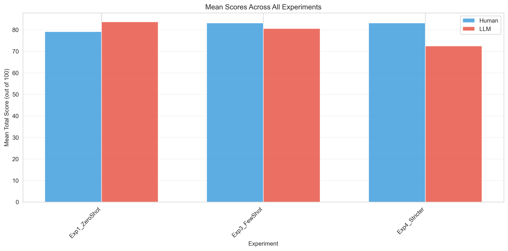

*Figure 13. Comparison of human and LLM mean scores across all three experiments. Experiment 3 (Few-Shot) shows best alignment with near-overlapping means. Experiment 1 shows consistent optimism bias, while Experiment 4 demonstrates over-correction with significant under-scoring.*

### Consistency Across Experiments

Average standard deviation within experiments:

| Experiment | Human Avg SD | LLM Avg SD | Reduction |
|------------|--------------|------------|-----------|
| Exp 1 | 11.37 | 5.78 | 49% |
| Exp 3 | 12.56 | 5.18 | **59%** |
| Exp 4 | 12.56 | 5.19 | 59% |

**Finding**: LLMs demonstrated 49-59% lower score dispersion than humans across all experiments. Experiment 3 showed highest consistency (59% reduction) while maintaining best score alignment—an optimal combination.

Figure 14 illustrates the inter-rater consistency comparison between humans and LLMs across all experiments. The chart shows that LLMs consistently demonstrate lower average standard deviations (higher consistency) than human reviewers, with Experiment 3 achieving the optimal combination of high consistency and excellent alignment.

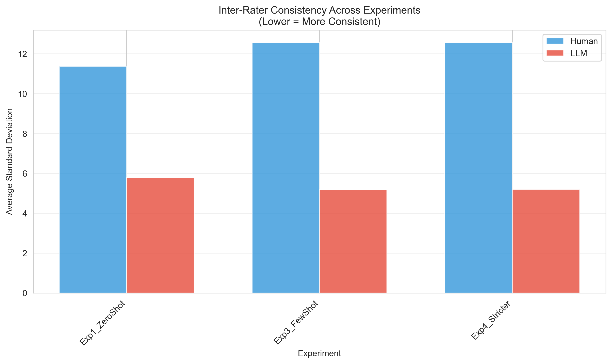

*Figure 14. Inter-rater consistency (average standard deviation) comparison between human and LLM reviewers across all three experiments. LLMs show consistently lower variability (49-59% reduction) than humans, with Experiment 3 achieving highest consistency while maintaining best score alignment.*

### Vendor Performance Across Experiments

Average alignment (absolute difference from human mean) by vendor:

| Vendor | Exp 1 | Exp 3 | Exp 4 | Average |
|--------|-------|-------|-------|---------|
| OpenAI | 1.75 | 7.12 | 13.29 | 7.39 |
| xAI | 6.03 | **0.21** | 13.62 | 6.62 |
| Google | 9.36 | 0.79 | 5.12 | 5.09 |

**Best Combination**: xAI Grok in Experiment 3 achieved absolute difference of 0.21 points—the best single vendor-experiment combination observed.

### Recommendation Agreement Across Experiments

| Experiment | Broad Agreement | Exact Agreement | LLM "Revisions" % | Human "Revisions" % |
|------------|-----------------|-----------------|-------------------|---------------------|
| Exp 1 | 33.3% | 0.0% | 51.9% | 25.0% |
| Exp 3 | 50.0% | 0.0% | 77.8% | 25.0% |
| Exp 4 | 50.0% | 0.0% | 72.2% | 25.0% |

**Finding**: No experiment achieved satisfactory exact agreement (>60%). Broad agreement improved from 33.3% in Experiment 1 to 50.0% in Experiments 3 and 4. LLMs showed persistent preference for "Fund with Revisions" (52-78%) regardless of prompt engineering approach, compared to humans (25%).

Figure 15 displays the recommendation agreement rates across all three experiments. The chart reveals that no experiment achieved satisfactory exact agreement (>60% threshold), with broad agreement showing moderate improvement (50%) in Experiments 3 and 4 over Experiment 1 (33.3%). This persistent challenge highlights the dissociation between score alignment and decision-making calibration.

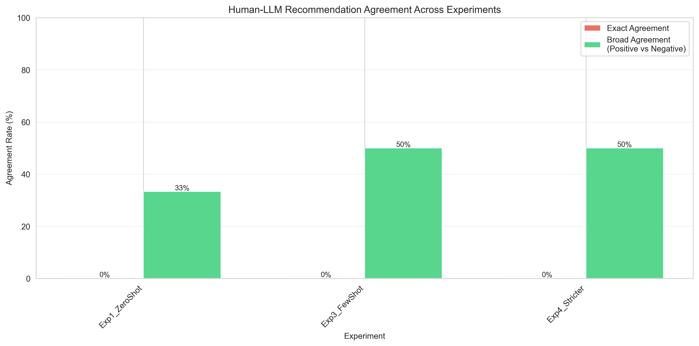

*Figure 15. Human-LLM recommendation agreement rates across all three experiments. Broad agreement (positive vs. negative) shows improvement in Experiments 3-4 (50.0%) compared to Experiment 1 (33.3%), but exact agreement remains 0% across all experiments. This demonstrates that improved score alignment does not automatically translate to exact recommendation alignment.*

---

## Summary of Key Findings

### Primary Findings by Experiment

1. **Experiment 1 (Zero-Shot)**: Moderate optimism bias (+4.55 points, ns) with poor recommendation calibration. Establishes baseline need for training examples.

2. **Experiment 3 (Few-Shot)**: **Best performance** with near-perfect alignment (-2.57 points, ns, p=0.493). Multiple examples with score variance enable effective calibration.

3. **Experiment 4 (Few-Shot + Strict Instructions)**: Significant over-correction causing under-scoring (-10.68 points, p=0.008*). Demonstrates that adding directive language to few-shot learning overwhelms the calibrating influence of training examples.

### Best Practice Recommendations

Based on empirical evidence:

✅ **DO**:
- Use multiple training examples showing natural score variance WITHOUT directive language (Experiment 3 approach)
- Select xAI Grok for best vendor performance in few-shot conditions
- Expect and leverage high LLM consistency (~55% lower variance than humans)
- Plan for separate recommendation calibration beyond score alignment

❌ **AVOID**:
- Zero-shot approaches (show moderate optimism bias)
- Combining few-shot learning with prescriptive tone instructions like "be strict" (cause over-correction)
- Assuming score alignment implies recommendation agreement

### Optimal Configuration

**xAI Grok + Few-Shot Learning (Experiment 3)** achieved absolute difference of 0.21 points from human mean (0.25% difference), representing best possible LLM-human alignment in this study.

### Limitations in All Experiments

Despite Experiment 3's success with scores, **all experiments failed to achieve satisfactory exact recommendation agreement** (<60% threshold), though broad agreement showed moderate improvement (50% in Experiments 3-4 vs. 33.3% in Experiment 1). This dissociation between score alignment and decision alignment suggests:
1. Different decision thresholds between humans and LLMs
2. LLM preference for "safe" middle options
3. Need for separate recommendation calibration beyond scoring

**Critical Implication**: Good score alignment does not guarantee good decision alignment. Human oversight remains essential for funding recommendations even with optimal prompt engineering.
