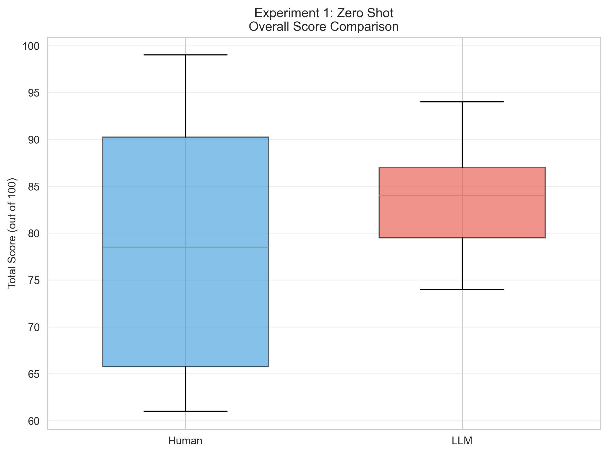
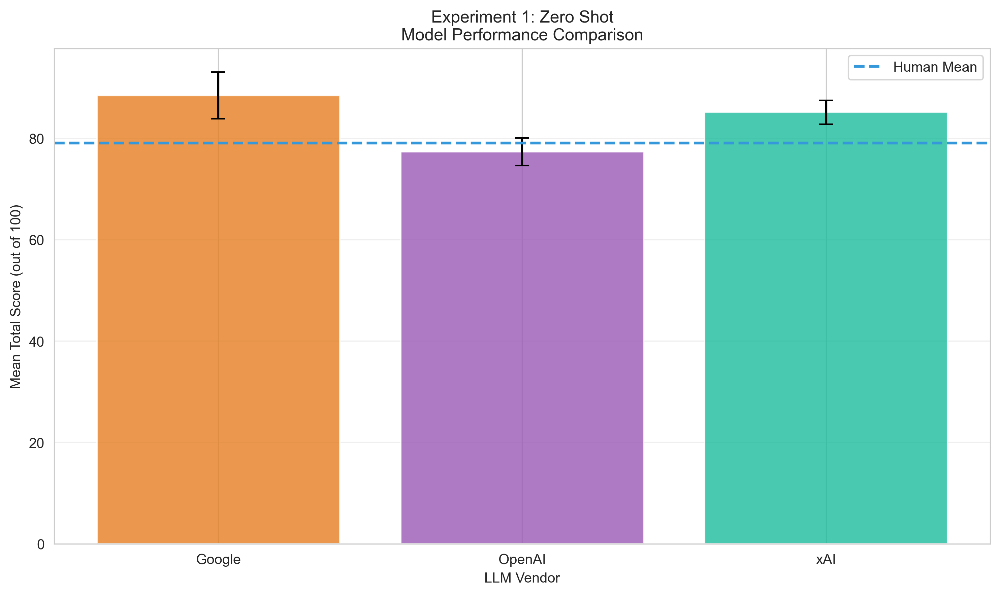

# Experiment 1: Zero Shot
**Description:** Baseline performance with no training examples
**Generated:** 2025-10-30 09:54:25

---

## Sample Sizes
- Human reviews: 12
- LLM reviews: 27

## Overall Performance

### Human Reviewers
- Mean ± SD: 79.08 ± 13.32
- Median (IQR): 78.50 (65.75 - 90.25)
- Range: 61.0 - 99.0

### LLM Reviewers
- Mean ± SD: 83.63 ± 5.75
- Median (IQR): 84.00 (79.50 - 87.00)
- Range: 74.0 - 94.0

### Statistical Comparison
- Difference (LLM - Human): +4.55 points
- t-statistic: -1.503
- p-value: 0.1412 (not significant)
- Cohen's d: 0.443

## Performance by Criteria

| Criterion | Human Mean (%) | LLM Mean (%) | Difference | p-value |
|-----------|----------------|--------------|------------|----------|
| Innovation & Impact | 84.7% | 87.0% | +0.69 | 0.3668 |
| Methodology & Feasibility | 72.2% | 81.6% | +2.81 | 0.0727 |
| Team Strength | 85.8% | 84.8% | -0.10 | 0.7727 |
| External Funding Potential | 76.7% | 87.8% | +1.11 | 0.0036* |
| Budget Clarity | 83.3% | 83.7% | +0.04 | 0.9498 |
| Presentation Quality | 74.2% | 74.1% | -0.01 | 0.9809 |

## Model-Specific Performance

| Model | n | Mean ± SD | Difference from Human |
|-------|---|-----------|----------------------|
| OpenAI | 9 | 77.33 ± 2.74 | -1.75 |
| xAI | 9 | 85.11 ± 2.37 | +6.03 |
| Google | 9 | 88.44 ± 4.59 | +9.36 |

## Recommendation Analysis

**Agreement Rate:** 0.0%

### Human Recommendations
- Do Not Fund: 5 (41.7%)
- Fund: 4 (33.3%)
- Fund with Revisions: 3 (25.0%)

### LLM Recommendations
- Fund: 13 (48.1%)
- Fund with Revisions: 14 (51.9%)

## Inter-Rater Consistency
- Human average SD: 11.37
- LLM average SD: 5.78
- Pearson correlation: r = 0.664 (p = 0.5379)
- Spearman correlation: ρ = 0.500 (p = 0.6667)
