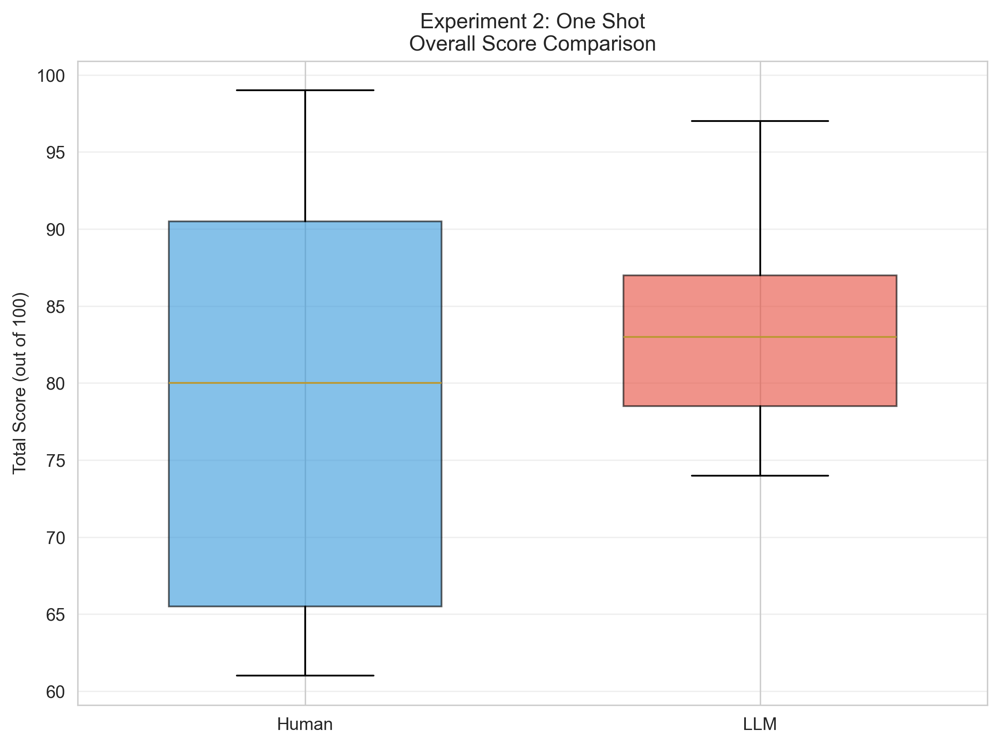
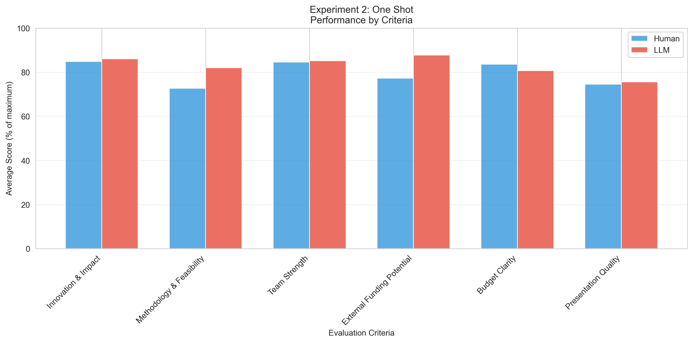
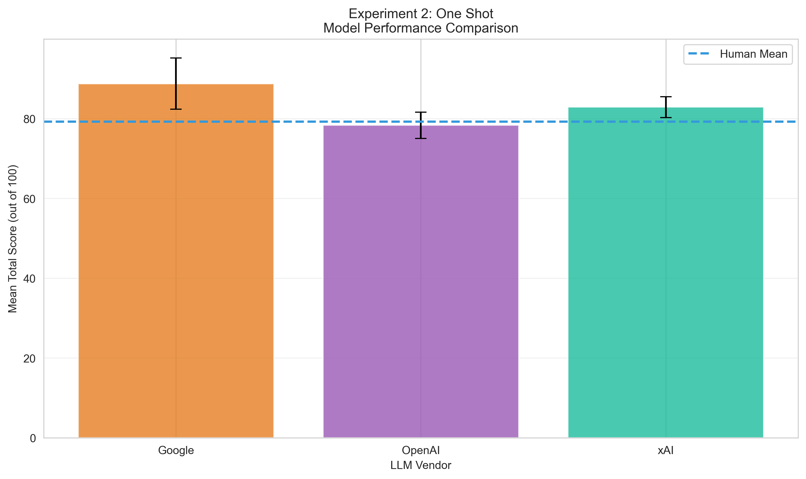
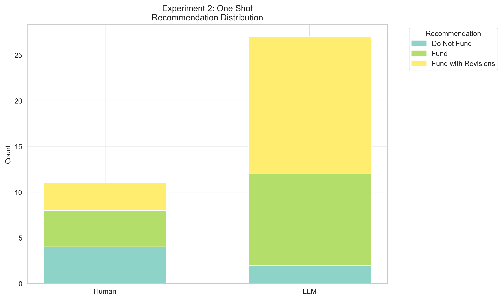

# Experiment 2: One Shot
**Description:** Single training example added
**Generated:** 2025-10-30 09:54:26

---

## Sample Sizes
- Human reviews: 11
- LLM reviews: 27
- *Note: HW's review of DANIEL excluded (used as training data)*

## Overall Performance

### Human Reviewers
- Mean ± SD: 79.27 ± 13.96
- Median (IQR): 80.00 (65.50 - 90.50)
- Range: 61.0 - 99.0

### LLM Reviewers
- Mean ± SD: 83.33 ± 6.09
- Median (IQR): 83.00 (78.50 - 87.00)
- Range: 74.0 - 97.0

### Statistical Comparison
- Difference (LLM - Human): +4.06 points
- t-statistic: -1.262
- p-value: 0.2150 (not significant)
- Cohen's d: 0.377

## Performance by Criteria

| Criterion | Human Mean (%) | LLM Mean (%) | Difference | p-value |
|-----------|----------------|--------------|------------|----------|
| Innovation & Impact | 84.8% | 86.0% | +0.36 | 0.6522 |
| Methodology & Feasibility | 72.7% | 82.0% | +2.77 | 0.0784 |
| Team Strength | 84.5% | 85.2% | +0.06 | 0.8771 |
| External Funding Potential | 77.3% | 87.8% | +1.05 | 0.0107* |
| Budget Clarity | 83.6% | 80.7% | -0.29 | 0.6580 |
| Presentation Quality | 74.5% | 75.6% | +0.10 | 0.8243 |

## Model-Specific Performance

| Model | n | Mean ± SD | Difference from Human |
|-------|---|-----------|----------------------|
| OpenAI | 9 | 78.33 ± 3.32 | -0.94 |
| xAI | 9 | 82.89 ± 2.62 | +3.62 |
| Google | 9 | 88.78 ± 6.40 | +9.51 |

## Recommendation Analysis

**Agreement Rate:** 33.3%

### Human Recommendations
- Do Not Fund: 4 (36.4%)
- Fund: 4 (36.4%)
- Fund with Revisions: 3 (27.3%)

### LLM Recommendations
- Do Not Fund: 2 (7.4%)
- Fund: 10 (37.0%)
- Fund with Revisions: 15 (55.6%)

## Inter-Rater Consistency
- Human average SD: 11.66
- LLM average SD: 5.64
- Pearson correlation: r = 0.993 (p = 0.0768)
- Spearman correlation: ρ = 1.000 (p = 0.0000)
