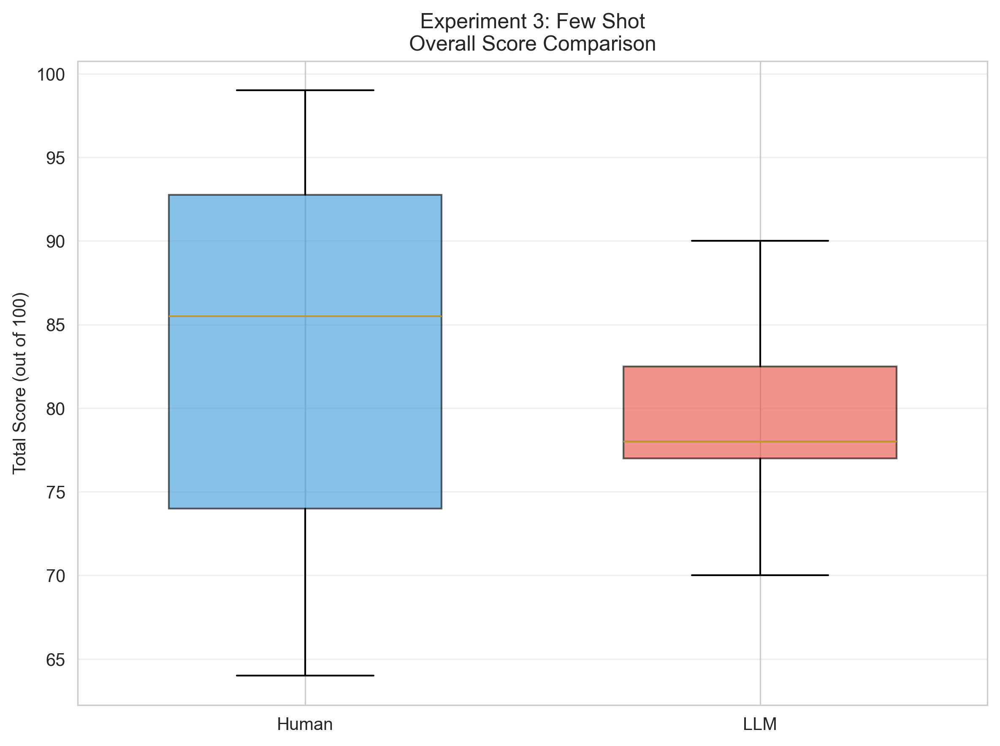
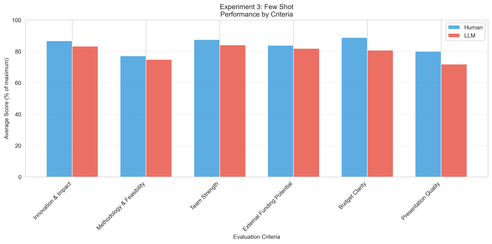
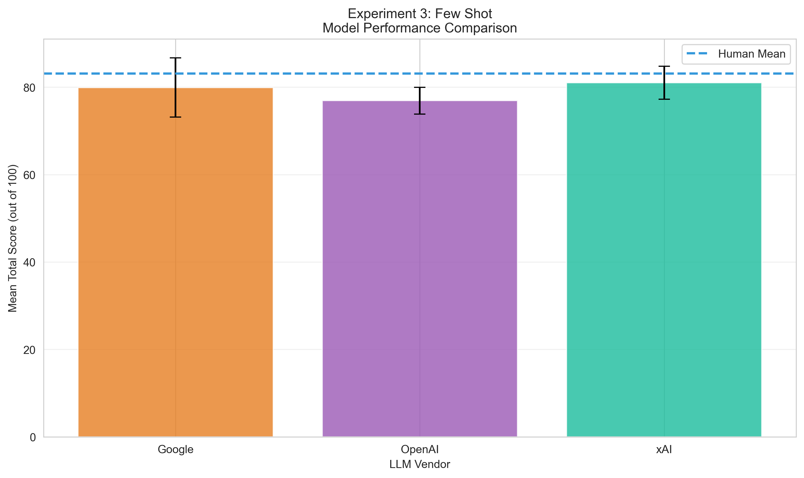
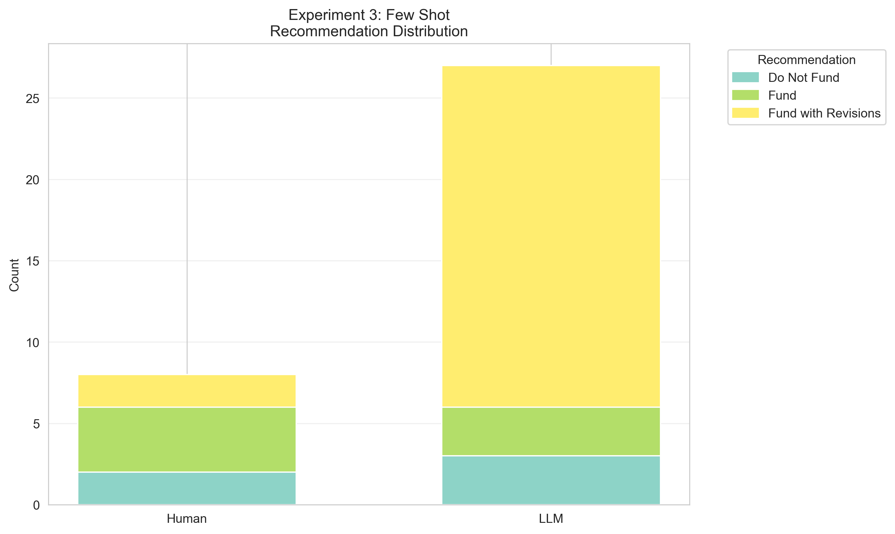

# Experiment 3: Few Shot
**Description:** Multiple training examples with variance
**Generated:** 2025-10-30 09:54:26

---

## Sample Sizes
- Human reviews: 8
- LLM reviews: 27
- *Note: All human reviews of DANIEL excluded (used as training data)*

## Overall Performance

### Human Reviewers
- Mean ± SD: 83.12 ± 13.73
- Median (IQR): 85.50 (74.00 - 92.75)
- Range: 64.0 - 99.0

### LLM Reviewers
- Mean ± SD: 79.26 ± 4.95
- Median (IQR): 78.00 (77.00 - 82.50)
- Range: 70.0 - 90.0

### Statistical Comparison
- Difference (LLM - Human): -3.87 points
- t-statistic: 1.247
- p-value: 0.2210 (not significant)
- Cohen's d: -0.375

## Performance by Criteria

| Criterion | Human Mean (%) | LLM Mean (%) | Difference | p-value |
|-----------|----------------|--------------|------------|----------|
| Innovation & Impact | 86.7% | 83.2% | -1.04 | 0.1424 |
| Methodology & Feasibility | 77.1% | 74.8% | -0.68 | 0.6877 |
| Team Strength | 87.5% | 84.1% | -0.34 | 0.4561 |
| External Funding Potential | 83.8% | 81.9% | -0.19 | 0.5985 |
| Budget Clarity | 88.8% | 80.7% | -0.80 | 0.1519 |
| Presentation Quality | 80.0% | 71.9% | -0.81 | 0.1098 |

## Model-Specific Performance

| Model | n | Mean ± SD | Difference from Human |
|-------|---|-----------|----------------------|
| xAI | 9 | 81.00 ± 3.77 | -2.12 |
| Google | 9 | 79.89 ± 6.77 | -3.24 |
| OpenAI | 9 | 76.89 ± 3.06 | -6.24 |

## Recommendation Analysis

**Agreement Rate:** 0.0%

### Human Recommendations
- Do Not Fund: 2 (25.0%)
- Fund: 4 (50.0%)
- Fund with Revisions: 2 (25.0%)

### LLM Recommendations
- Do Not Fund: 3 (11.1%)
- Fund: 3 (11.1%)
- Fund with Revisions: 21 (77.8%)

## Inter-Rater Consistency
- Human average SD: 12.56
- LLM average SD: 4.35
- Pearson correlation: r = 1.000 (p = 1.0000)
- Spearman correlation: ρ = 1.000 (p = nan)
