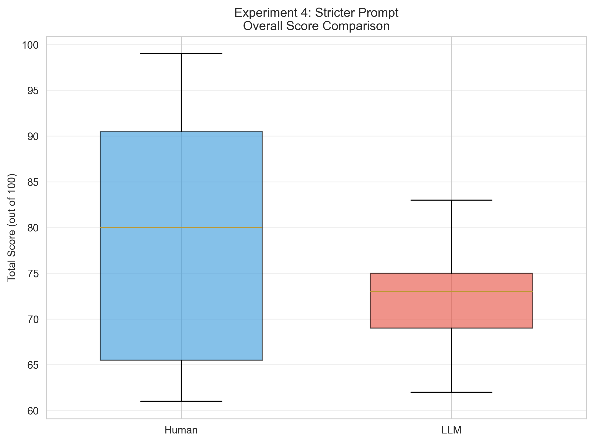
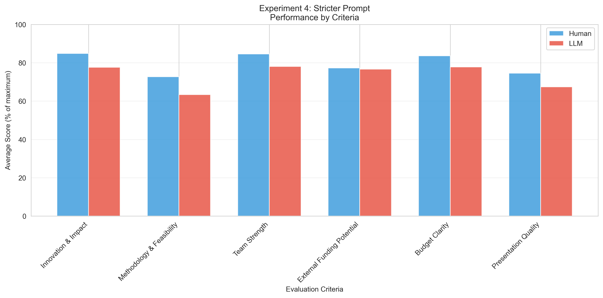
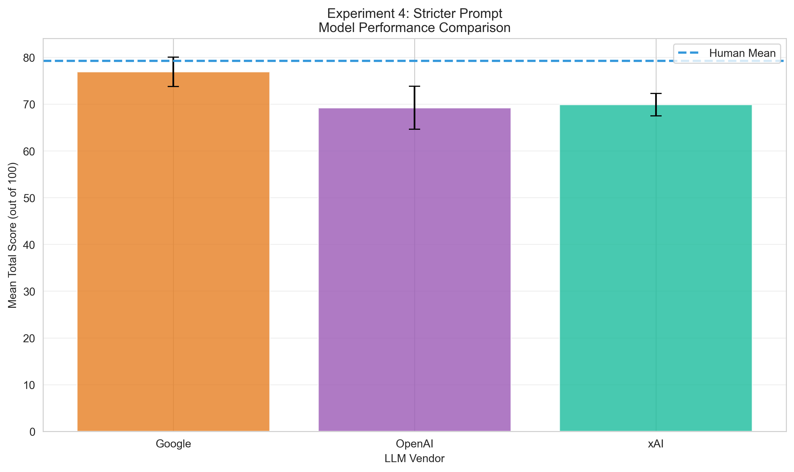
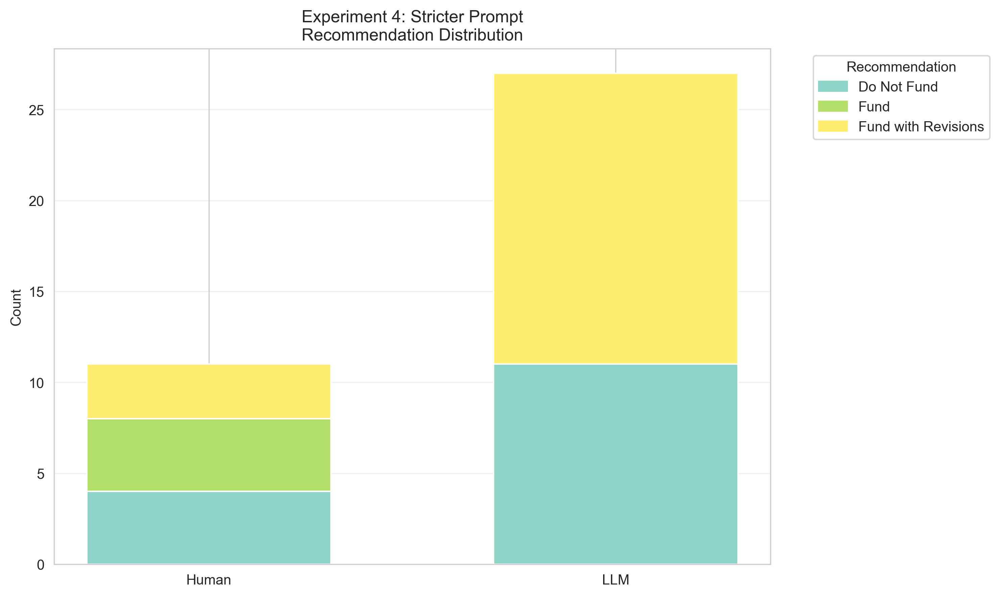

# Experiment 4: Stricter Prompt
**Description:** Stricter prompt with one shot example
**Generated:** 2025-10-30 09:54:27

---

## Sample Sizes
- Human reviews: 11
- LLM reviews: 27
- *Note: HW's review of DANIEL excluded (used as training data)*

## Overall Performance

### Human Reviewers
- Mean ± SD: 79.27 ± 13.96
- Median (IQR): 80.00 (65.50 - 90.50)
- Range: 61.0 - 99.0

### LLM Reviewers
- Mean ± SD: 72.00 ± 4.88
- Median (IQR): 73.00 (69.00 - 75.00)
- Range: 62.0 - 83.0

### Statistical Comparison
- Difference (LLM - Human): -7.27 points
- t-statistic: 2.407
- p-value: 0.0213 (significant)
- Cohen's d: -0.696

## Performance by Criteria

| Criterion | Human Mean (%) | LLM Mean (%) | Difference | p-value |
|-----------|----------------|--------------|------------|----------|
| Innovation & Impact | 84.8% | 77.7% | -2.16 | 0.0040* |
| Methodology & Feasibility | 72.7% | 63.3% | -2.82 | 0.0773 |
| Team Strength | 84.5% | 78.1% | -0.65 | 0.1810 |
| External Funding Potential | 77.3% | 76.7% | -0.06 | 0.8867 |
| Budget Clarity | 83.6% | 77.8% | -0.59 | 0.3489 |
| Presentation Quality | 74.5% | 67.4% | -0.71 | 0.0922 |

## Model-Specific Performance

| Model | n | Mean ± SD | Difference from Human |
|-------|---|-----------|----------------------|
| Google | 9 | 76.89 ± 3.14 | -2.38 |
| xAI | 9 | 69.89 ± 2.42 | -9.38 |
| OpenAI | 9 | 69.22 ± 4.60 | -10.05 |

## Recommendation Analysis

**Agreement Rate:** 33.3%

### Human Recommendations
- Do Not Fund: 4 (36.4%)
- Fund: 4 (36.4%)
- Fund with Revisions: 3 (27.3%)

### LLM Recommendations
- Do Not Fund: 11 (40.7%)
- Fund with Revisions: 16 (59.3%)

## Inter-Rater Consistency
- Human average SD: 11.66
- LLM average SD: 4.77
- Pearson correlation: r = 0.069 (p = 0.9557)
- Spearman correlation: ρ = 0.500 (p = 0.6667)
