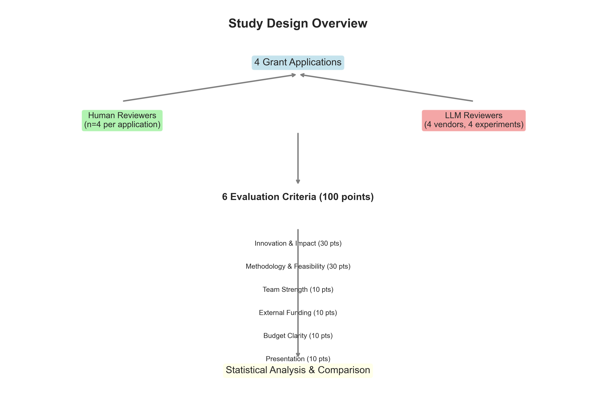
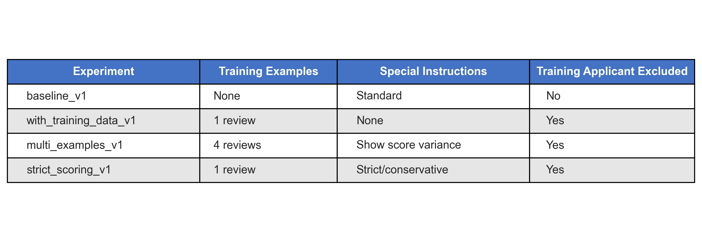
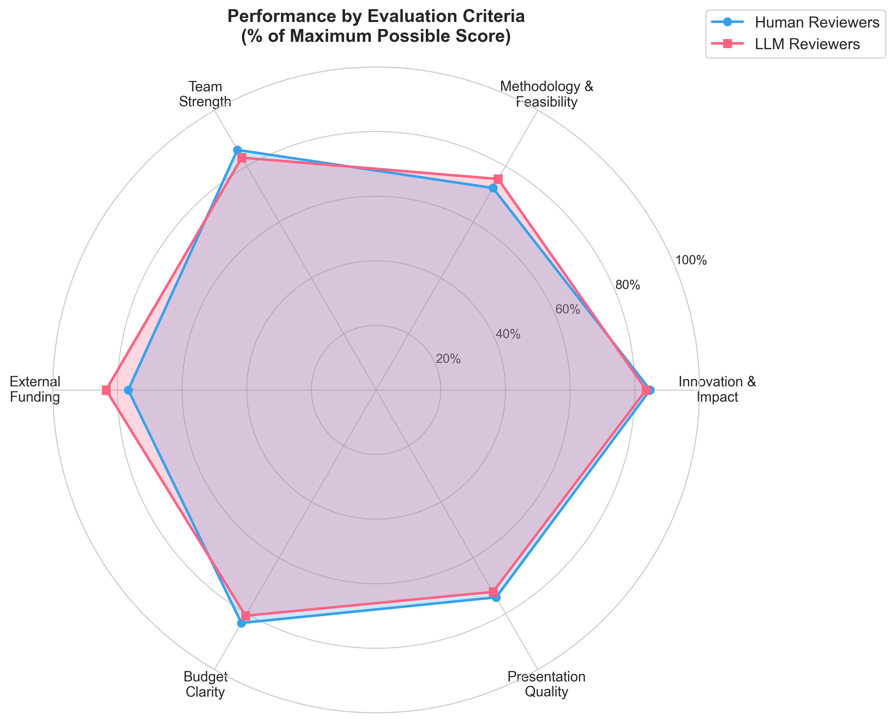
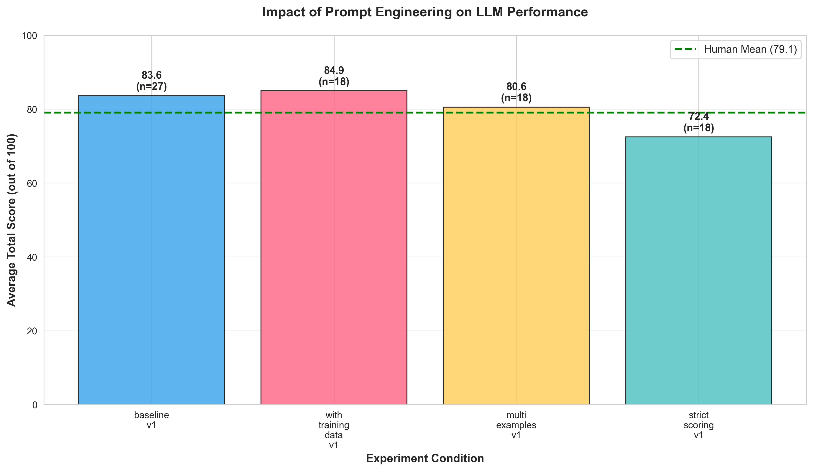
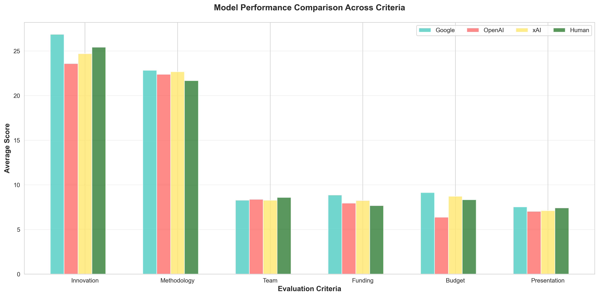
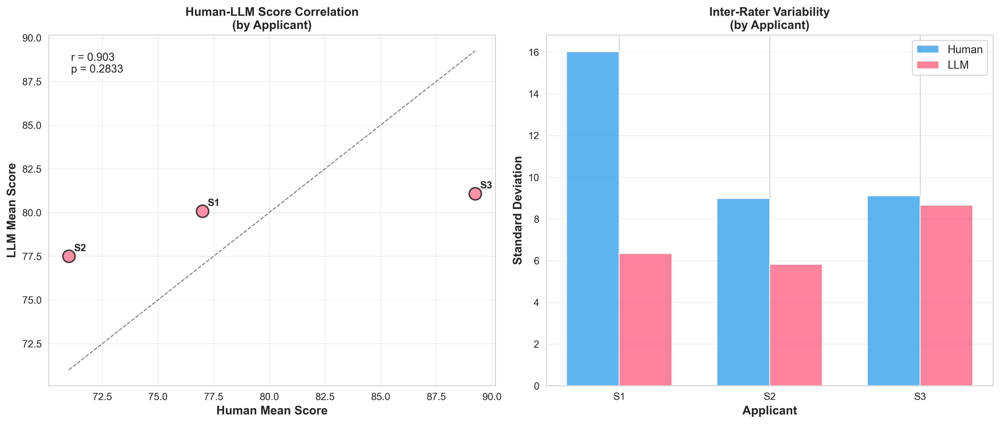

# Presentation Materials

This folder contains materials for presenting the grant review LLM research findings.

## Contents

- **`presentation_outline.md`** - Complete 11-slide presentation outline with embedded figures and analysis results
- **`generate_figures.py`** - Python script to generate all presentation figures from the database
- **`generate_analyses.py`** - Python script to calculate statistical findings and key results
- **`slide*.png`** - Generated figure files (8 figures total)
- **`analysis_results.json`** - Statistical analysis results in JSON format
- **`analysis_output.txt`** - Full text output of statistical analyses

## Generating Materials

### Step 1: Generate Statistical Analyses

Run the analysis script to calculate all key findings:

```bash
python presentation/generate_analyses.py
```

This will:
1. Load data from `data/results.db`
2. Calculate 6 comprehensive analyses:
   - Overall human vs. LLM performance
   - Performance by evaluation criteria
   - Prompt engineering impact
   - Model-specific performance
   - Inter-rater reliability
   - Recommendation agreement
3. Generate formatted output for slides
4. Save results to `analysis_results.json`

### Step 2: Generate Figures

Generate all presentation visualizations:

```bash
python presentation/generate_figures.py
```

This will:
1. Load data from `data/results.db`
2. Generate 8 high-resolution PNG figures (300 DPI)
3. Save all figures to the `presentation/` directory
4. Apply proper data exclusions (e.g., Daniel excluded from training data experiments)

### Requirements

The script requires the following Python packages:
- pandas
- matplotlib
- seaborn
- scipy
- numpy

Install with:
```bash
pip install pandas matplotlib seaborn scipy numpy
```

## Presentation Structure (11 Slides)

### Slide 1: Title Slide
Introduction and attribution

### Slide 2: Background & Motivation

- Challenges of grant review
- Research question

### Slide 3: Study Design

- Dataset overview
- Evaluation criteria
- Study flowchart

### Slide 4: Prompt Engineering Experiments

- Four experimental conditions
- Training data strategy

### Slide 5: Human vs. LLM Performance Overview

- Overall score comparison
- Statistical analysis

### Slide 6: Performance by Evaluation Criteria

- Radar chart comparison
- Criterion-level insights

### Slide 7: Impact of Prompt Engineering

- Experiment performance comparison
- Effect of training data

### Slide 8: Model-Specific Performance

- Vendor comparison across criteria
- Model strengths/weaknesses

### Slide 9: Inter-Rater Reliability & Agreement

- Human-LLM correlation
- Variability analysis
- **Note:** Applicant names anonymized as S1, S2, S3, S4 for blinding

### Slide 10: Conclusions & Implications
Key findings and practical recommendations

### Slide 11: Future Directions & Acknowledgments
Next research steps and credits

## Converting to Presentation Format

### Option 1: Marp (Recommended - Markdown Presentation Ecosystem)

**We've created a Marp-ready version:** `presentation_marp.md`

Install Marp CLI:
```bash
npm install -g @marp-team/marp-cli
```

Generate slides:
```bash
# PDF output (recommended for distribution)
marp presentation/presentation_marp.md -o presentation/slides.pdf

# PowerPoint output
marp presentation/presentation_marp.md -o presentation/slides.pptx

# HTML output (for web viewing)
marp presentation/presentation_marp.md -o presentation/slides.html
```

Or use Marp VS Code extension for live preview and export.

**Features included:**
- Custom SBU color scheme (maroon #990000)
- Automatic pagination
- Footer with presentation title
- Image sizing and centering
- Professional table formatting
- Lead slides for title and section breaks
- 4 supplementary slides included

### Option 2: Markdown to PDF/PowerPoint with Pandoc

```bash
pandoc presentation_outline.md -o presentation.pptx
```

### Option 3: Manual Import to PowerPoint/Keynote/Google Slides

1. Open the presentation software
2. Create slides following the outline structure
3. Import figures from the `presentation/` folder
4. Add speaker notes from the markdown content

## Customization

### Updating Figures

To customize figure generation:
1. Edit `generate_figures.py`
2. Modify colors, layouts, or add new figures
3. Run the script to regenerate

### Adding Content

The presentation outline can be easily extended with:
- Additional slides in the markdown file
- New figure generation functions in the Python script
- Supplementary materials

## Data Notes

- **Human reviews:** 12 total (3 applicants × 4 reviewers)
- **LLM reviews:** 108 total (3 applicants × 4 models × 4 experiments × ~2.25 avg iterations)
- **Daniel exclusion:** Applied automatically in experiments using training data
- **Rosie exclusion:** Rosie's data excluded from all analyses per request
- **Statistical tests:** Two-sample t-tests, Pearson correlations included in figures

## Tips for Presenting

1. **Slide 5-9:** These contain the core findings - allocate most presentation time here
2. **Slide 7:** Key slide for demonstrating prompt engineering impact
3. **Slide 9:** Important for discussing reliability and trustworthiness
4. **Be prepared to discuss:**
   - Sample size limitations
   - Generalizability to other grant programs
   - Ethical considerations of AI-assisted review
   - Practical implementation challenges

## Export Quality

All figures are generated at 300 DPI, suitable for:
- Conference presentations
- Publication in papers
- Poster printing
- High-quality handouts
