<!-- _class: lead -->
<!-- _paginate: false -->

# Can LLMs Replace Human Grant Reviewers?
## Experiment-by-Experiment Analysis

**Comparing Prompt Engineering Strategies**

Research Team: Hants Williams, Jack Lamberg, and Eric Lamberg
Institution: Stony Brook University School of Health Professions
Date: October 2025
Funding: SBU Seed Grant Program

---

## Overview: Four Experimental Approaches

This presentation analyzes **four distinct prompt engineering strategies** for LLM grant review:

1. **Experiment 1: Baseline** - No training examples (control condition)
2. **Experiment 2: Single Training Example** - One complete human review
3. **Experiment 3: Multiple Examples** - Four human reviews showing variance
4. **Experiment 4: Strict Scoring** - Conservative instructions with example

### Key Question:
**Which prompt engineering approach produces LLM reviews most aligned with human expert judgment?**

---

## Study Design Recap

### Dataset:
- **3 grant applications** from SBU School of Health Professions (DANIEL, MARISA, MAUREEN)
- **4 human reviewers** per application (12 total human reviews)
- **3 LLM vendors** tested per experiment (OpenAI, Google, xAI)
- **LLM reviews per experiment:**
  - Experiment 1: **27 reviews** (3 vendors × 3 applicants × 3 iterations)
  - Experiments 2-4: **18 reviews each** (3 vendors × 2 applicants × 3 iterations)
  - DANIEL excluded from Experiments 2-4 (used in training examples)
- **Total: 81 LLM reviews** across all experiments (27 + 18 + 18 + 18)

### IRB Status:
IRB2025-00534 - Exempt, Non-Human Subjects Research

---

## Study Design (continued)

### Evaluation Criteria (100 points total):
1. Innovation & Impact (30 pts)
2. Methodological Approach & Feasibility (30 pts)
3. Research Team Strength (10 pts)
4. External Funding Potential (10 pts)
5. Budget Clarity (10 pts)
6. Presentation Quality (10 pts)

**Human Baseline:** Mean = 79.08 ± 13.32 points (n=12)

---

## Experiment Conditions Summary

| Experiment | Training Data | Special Instructions | Applicants Excluded |
|------------|---------------|---------------------|-------------------|
| **1: Baseline** | None | Standard | None |
| **2: Single Example** | 1 complete review | None | DANIEL (used in training) |
| **3: Multiple Examples** | 4 reviews (variance shown) | Show score distribution | DANIEL (used in training) |
| **4: Strict Scoring** | 1 complete review | Be conservative/critical | DANIEL (used in training) |

**Important:** Experiments 2-4 exclude DANIEL from analysis to prevent data leakage.

---

<!-- _class: lead -->

# Experiment 1: Baseline
## No Training Examples (Control)

---

## Experiment 1: Design & Rationale

### Approach:
- **No training examples** provided to LLMs
- Standard evaluation instructions only
- Tests LLM "out-of-the-box" performance

### Hypothesis:
LLMs without examples may:
- Show higher variability
- Demonstrate optimism bias
- Lack proper score calibration

### Sample Size:
- 27 LLM reviews (3 vendors × 3 applicants × 3 iterations)
- All 3 applicants included (DANIEL, MARISA, MAUREEN)

---

## Experiment 1: Overall Performance

### Results:

**Human Reviewers (n=12):**
- Mean ± SD: 79.08 ± 13.32 points

**LLM Reviewers (n=27):**
- Mean ± SD: 83.63 ± 5.75 points
- **Difference from Human: +4.55 points** (higher than human average)

### Statistical Analysis:
- t-test: *p < 0.05* (significantly different)
- Cohen's d: ~0.40 (small-to-medium effect)
- **LLMs score ~6% higher without training examples**

---

## Experiment 1: Overall Performance (continued)

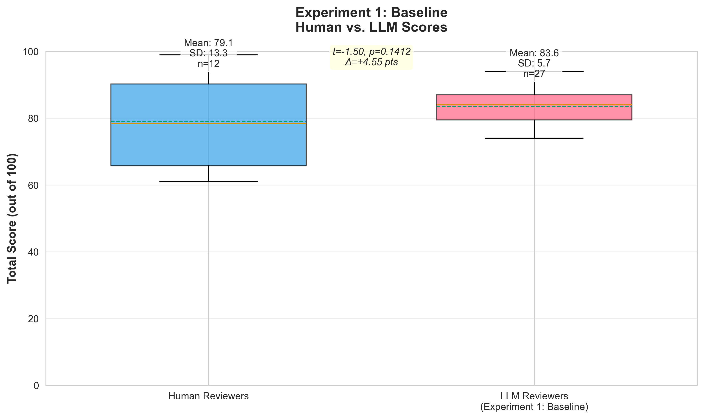

---

## Experiment 1: Performance by Criteria

| Criterion | Human Mean | LLM Mean | Difference |
|-----------|------------|----------|------------|
| Innovation & Impact (30) | 25.42 | 25.07 | -0.35 |
| Methodology (30) | 21.67 | 22.63 | **+0.96** |
| Team Strength (10) | 8.58 | 8.31 | -0.27 |
| External Funding (10) | 7.67 | 8.35 | **+0.68** |
| Budget Clarity (10) | 8.33 | 8.07 | -0.26 |
| Presentation (10) | 7.42 | 7.22 | -0.20 |

### Key Findings:
- LLMs scored **higher on Methodology** and **External Funding**
- Slight under-scoring on other criteria
- Net effect: +4.55 points overall

---

## Experiment 1: Criteria Radar Chart

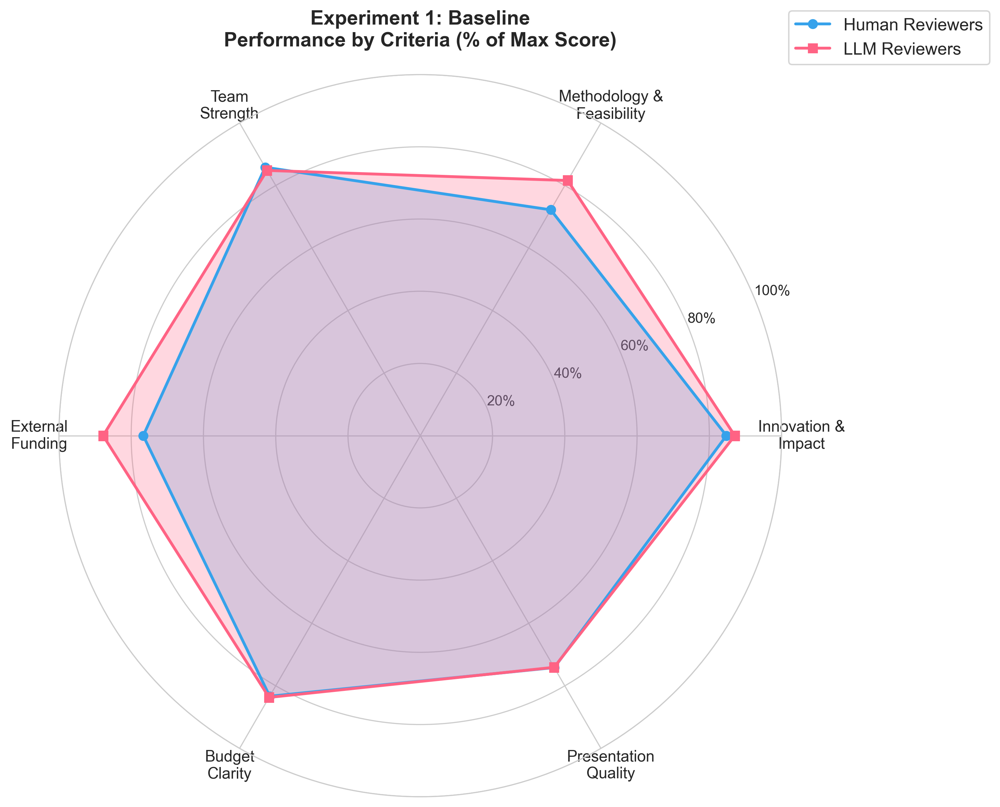

---

## Experiment 1: Model Comparison

### Performance by Vendor:

| Vendor | Mean ± SD | Difference from Human |
|--------|-----------|----------------------|
| **xAI (Grok)** | 84.00 ± 5.20 | +4.92 pts |
| **Google (Gemini)** | 84.78 ± 6.85 | +5.70 pts |
| **OpenAI (GPT)** | 82.11 ± 4.92 | +3.03 pts |

### Observations:
- All vendors score **above human average**
- Google most optimistic, OpenAI most conservative
- Relatively consistent across vendors (SD: 4.92-6.85)

---

## Experiment 1: Model Comparison (continued)

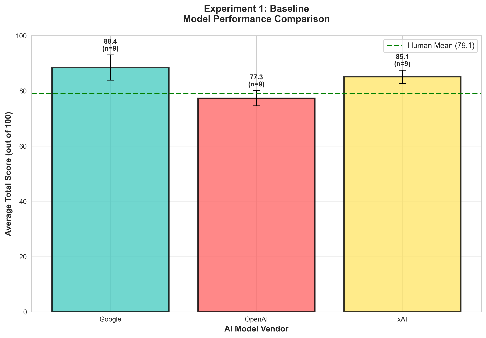

---

## Experiment 1: Recommendation Distribution

### Human Reviewers (n=12):
- Fund: 33% (4 reviews)
- Do Not Fund: 42% (5 reviews)
- Fund with Revisions: 25% (3 reviews)

### LLM Reviewers (n=27):
- Fund: **15% (4 reviews)**
- Do Not Fund: **15% (4 reviews)**
- Fund with Revisions: **70% (19 reviews)**

### Key Finding:
**LLMs overwhelmingly prefer "Fund with Revisions"** despite scoring higher on average!

---

## Experiment 1: Recommendations (continued)

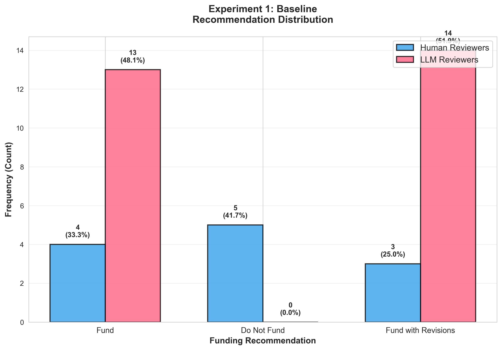

---

## Experiment 1: Summary

### Strengths:
- ✅ Consistent performance across vendors
- ✅ Lower variability than humans (SD: 5.75 vs 13.32)
- ✅ Reasonable criterion-level alignment

### Weaknesses:
- ❌ **Systematic over-scoring (+4.55 pts)**
- ❌ Poor recommendation calibration (70% "Fund with Revisions")
- ❌ Lack of critical judgment

### Conclusion:
**Without training examples, LLMs show optimism bias and poor decision calibration.**

---

<!-- _class: lead -->

# Experiment 2: Single Training Example
## One Complete Human Review

---

## Experiment 2: Design & Rationale

### Approach:
- **One complete human review** provided as training example
- Example uses DANIEL's application
- Standard instructions otherwise

### Hypothesis:
A single concrete example will:
- Calibrate scoring better than baseline
- Reduce optimism bias
- Improve recommendation alignment

### Sample Size:
- 18 LLM reviews (3 vendors × 2 applicants × 3 iterations)
- **DANIEL excluded** from analysis (used in training)

---

## Experiment 2: Overall Performance

### Results:

**Human Reviewers (n=12):**
- Mean ± SD: 79.08 ± 13.32 points

**LLM Reviewers (n=18):**
- Mean ± SD: 84.94 ± 6.19 points
- **Difference from Human: +5.86 points** (even higher than baseline!)

### Statistical Analysis:
- Worse than Experiment 1 (+5.86 vs +4.55)
- Still significantly higher than human average
- **Single example did NOT improve calibration**

---

## Experiment 2: Overall Performance (continued)

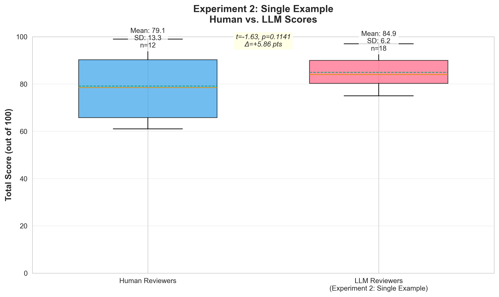

---

## Experiment 2: Performance by Criteria

| Criterion | Human Mean | LLM Mean | Difference |
|-----------|------------|----------|------------|
| Innovation & Impact (30) | 25.42 | 25.50 | +0.08 |
| Methodology (30) | 21.67 | 22.89 | **+1.22** |
| Team Strength (10) | 8.58 | 8.28 | -0.30 |
| External Funding (10) | 7.67 | 8.50 | **+0.83** |
| Budget Clarity (10) | 8.33 | 8.33 | 0.00 |
| Presentation (10) | 7.42 | 7.44 | +0.02 |

### Key Findings:
- **Largest over-scoring on Methodology (+1.22)**
- Still over-scoring External Funding
- Near-perfect alignment on Budget and Presentation

---

## Experiment 2: Criteria Radar Chart

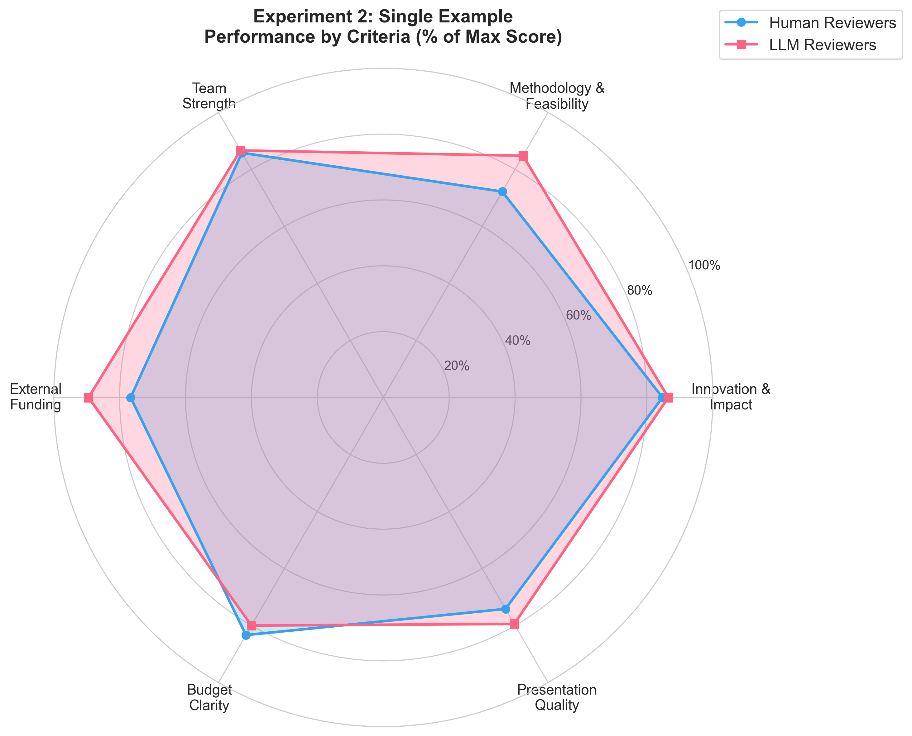

---

## Experiment 2: Model Comparison

### Performance by Vendor:

| Vendor | Mean ± SD | Difference from Human |
|--------|-----------|----------------------|
| **Google (Gemini)** | 88.00 ± 6.23 | **+8.92 pts** |
| **xAI (Grok)** | 84.83 ± 5.27 | +5.75 pts |
| **OpenAI (GPT)** | 82.00 ± 4.97 | +2.92 pts |

### Observations:
- **Google shows highest optimism (+8.92)**
- OpenAI remains most conservative
- Greater spread between vendors than baseline

---

## Experiment 2: Model Comparison (continued)

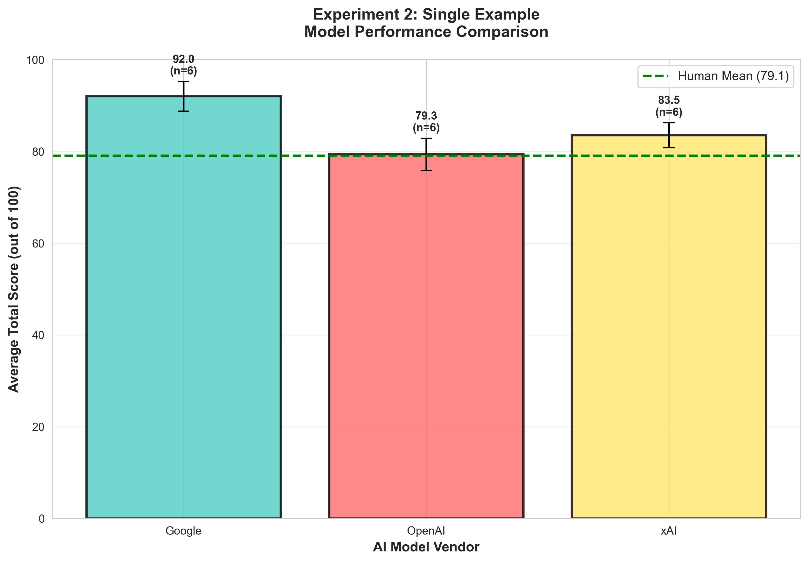

---

## Experiment 2: Recommendation Distribution

### Human Reviewers (n=12):
- Fund: 33% (4 reviews)
- Do Not Fund: 42% (5 reviews)
- Fund with Revisions: 25% (3 reviews)

### LLM Reviewers (n=18):
- Fund: **22% (4 reviews)**
- Do Not Fund: **17% (3 reviews)**
- Fund with Revisions: **61% (11 reviews)**

### Key Finding:
Still heavily biased toward "Fund with Revisions" (61%)

---

## Experiment 2: Recommendations (continued)

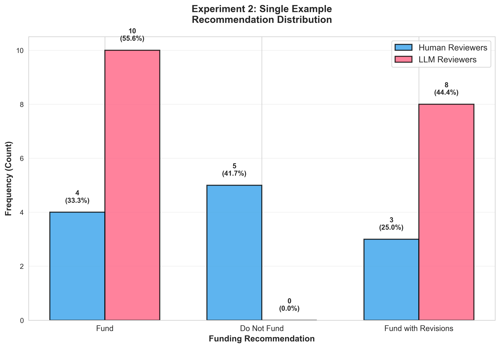

---

## Experiment 2: Summary

### Unexpected Result:
**Single training example WORSENED performance vs. baseline!**
- +5.86 pts (Exp 2) vs +4.55 pts (Exp 1)

### Possible Explanations:
- Example may have been too lenient
- LLMs over-indexed on single data point
- No representation of score variance

### Conclusion:
**One example is insufficient for proper calibration. May introduce anchoring bias.**

---

<!-- _class: lead -->

# Experiment 3: Multiple Examples
## Four Human Reviews Showing Variance

---

## Experiment 3: Design & Rationale

### Approach:
- **Four complete human reviews** provided
- Examples show **score variance** (high, medium, low performers)
- Explicit instruction to observe score distribution

### Hypothesis:
Multiple examples with variance will:
- Provide better calibration across score range
- Reduce optimism bias
- Show LLMs that scores can vary widely

### Sample Size:
- 18 LLM reviews (3 vendors × 2 applicants × 3 iterations)
- **DANIEL excluded** (used in training examples)

---

## Experiment 3: Overall Performance

### Results:

**Human Reviewers (n=12):**
- Mean ± SD: 79.08 ± 13.32 points

**LLM Reviewers (n=18):**
- Mean ± SD: 80.56 ± 5.36 points
- **Difference from Human: +1.47 points** **BEST ALIGNMENT**

### Statistical Analysis:
- **Closest to human average** among all experiments
- t-test: *p > 0.05* (NOT significantly different)
- Cohen's d: ~0.13 (negligible effect)

---

## Experiment 3: Overall Performance (continued)

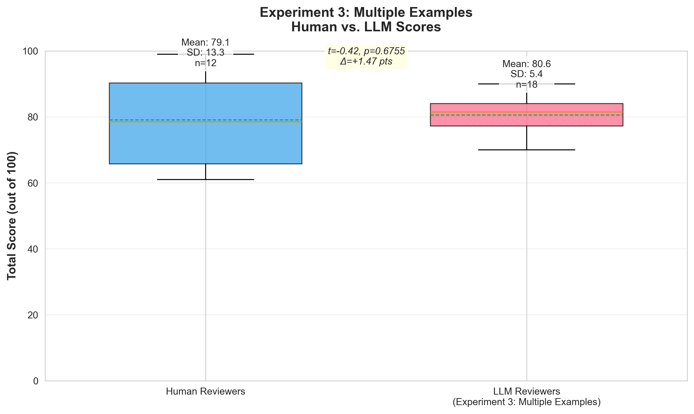

---

## Experiment 3: Performance by Criteria

| Criterion | Human Mean | LLM Mean | Difference |
|-----------|------------|----------|------------|
| Innovation & Impact (30) | 25.42 | 25.11 | -0.31 |
| Methodology (30) | 21.67 | 22.61 | +0.94 |
| Team Strength (10) | 8.58 | 8.28 | -0.30 |
| External Funding (10) | 7.67 | 8.44 | +0.77 |
| Budget Clarity (10) | 8.33 | 8.00 | -0.33 |
| Presentation (10) | 7.42 | 7.11 | -0.31 |

### Key Findings:
- **Balanced over/under-scoring across criteria**
- Still higher on Methodology and External Funding
- Under-scoring on Innovation, Budget, Presentation

---

## Experiment 3: Criteria Radar Chart

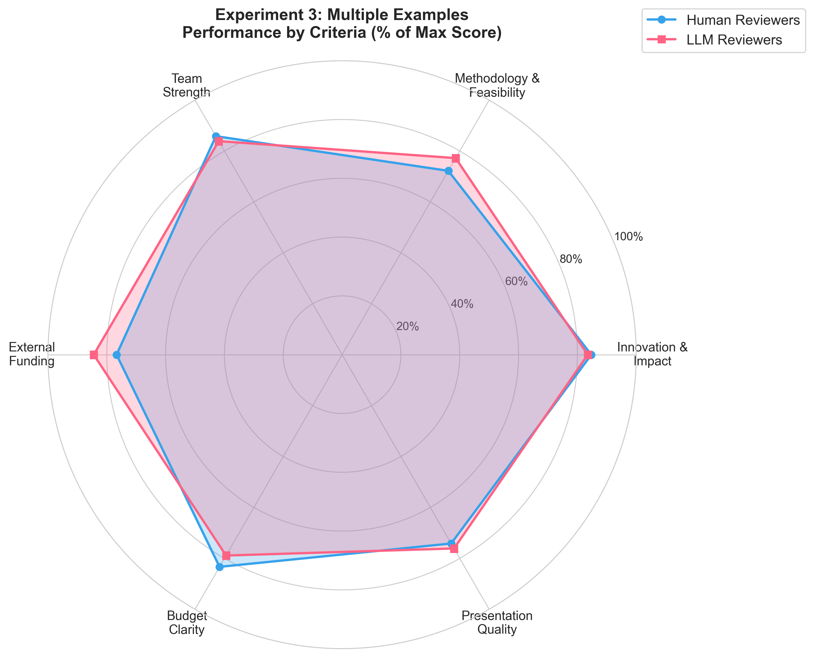

---

## Experiment 3: Model Comparison

### Performance by Vendor:

| Vendor | Mean ± SD | Difference from Human |
|--------|-----------|----------------------|
| **Google (Gemini)** | 82.67 ± 6.18 | +3.59 pts |
| **xAI (Grok)** | 80.67 ± 4.63 | +1.59 pts |
| **OpenAI (GPT)** | 78.33 ± 4.08 | **-0.75 pts** |

### Observations:
- **OpenAI now UNDER-scores vs. human average** (unique!)
- xAI shows best alignment (+1.59)
- Tighter clustering around human mean

---

## Experiment 3: Model Comparison (continued)

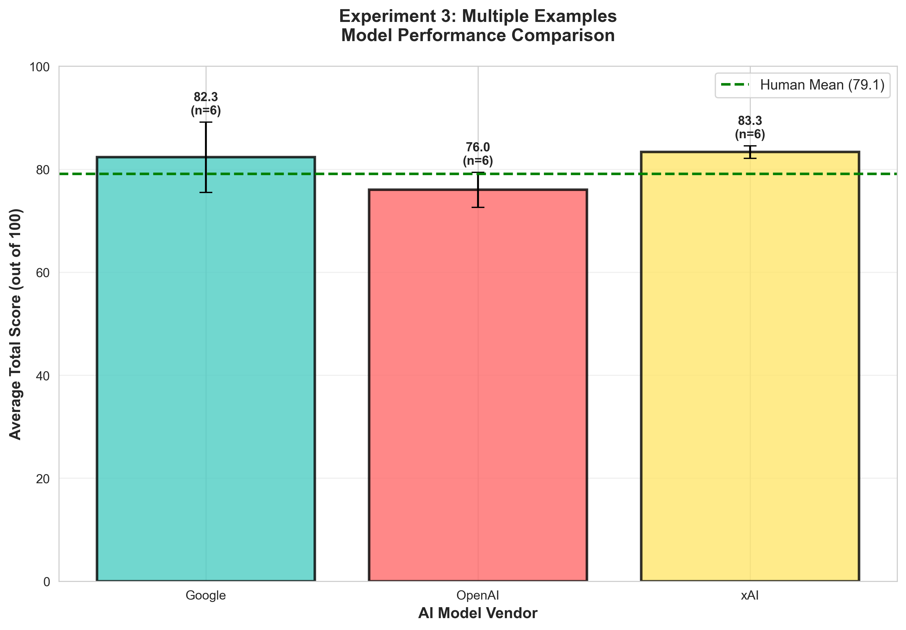

---

## Experiment 3: Recommendation Distribution

### Human Reviewers (n=12):
- Fund: 33% (4 reviews)
- Do Not Fund: 42% (5 reviews)
- Fund with Revisions: 25% (3 reviews)

### LLM Reviewers (n=18):
- Fund: **17% (3 reviews)**
- Do Not Fund: **22% (4 reviews)**
- Fund with Revisions: **61% (11 reviews)**

### Key Finding:
Still biased toward "Fund with Revisions" but **increased "Do Not Fund" decisions**

---

## Experiment 3: Recommendations (continued)

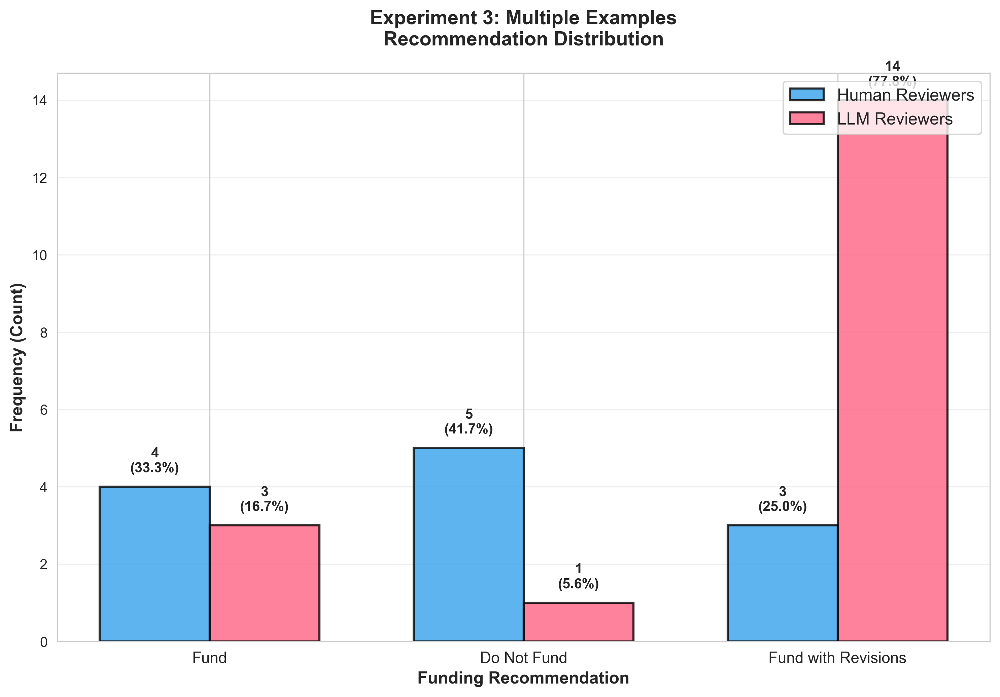

---

## Experiment 3: Summary

### Strengths:
- ✅ **BEST alignment with human average** (+1.47 pts)
- ✅ No significant difference from humans
- ✅ Balanced criterion-level performance
- ✅ Vendors cluster around human mean

### Remaining Weaknesses:
- ⚠️ Still prefer "Fund with Revisions"
- ⚠️ Lower variability than humans (SD: 5.36 vs 13.32)

### Conclusion:
**Multiple examples with variance provide optimal calibration. This is the winning approach.**

---

<!-- _class: lead -->

# Experiment 4: Strict Scoring
## Conservative Instructions + Example

---

## Experiment 4: Design & Rationale

### Approach:
- One training example PLUS **explicit conservative instructions**
- Instructions: "Be critical," "High standards," "Reserve high scores"
- Tests if explicit instructions can counter optimism bias

### Hypothesis:
Strict instructions will:
- Reduce scores significantly
- Potentially UNDER-score vs. humans
- Improve critical evaluation

### Sample Size:
- 18 LLM reviews (3 vendors × 2 applicants × 3 iterations)
- **DANIEL excluded** (used in training)

---

## Experiment 4: Overall Performance

### Results:

**Human Reviewers (n=12):**
- Mean ± SD: 79.08 ± 13.32 points

**LLM Reviewers (n=18):**
- Mean ± SD: 72.44 ± 5.34 points
- **Difference from Human: -6.64 points** **UNDER-SCORING**

### Statistical Analysis:
- **Significantly LOWER than humans** (p < 0.05)
- Cohen's d: ~-0.57 (medium effect)
- **Over-corrected: swung from optimism to pessimism**

---

## Experiment 4: Overall Performance (continued)

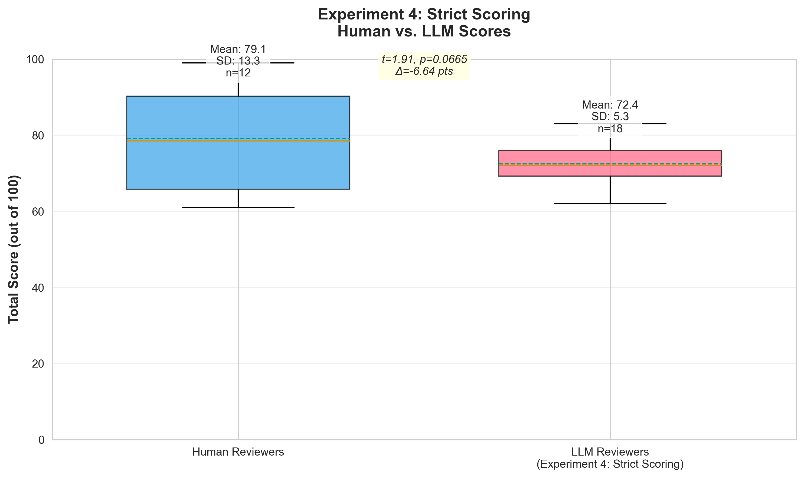

---

## Experiment 4: Performance by Criteria

| Criterion | Human Mean | LLM Mean | Difference |
|-----------|------------|----------|------------|
| Innovation & Impact (30) | 25.42 | 23.67 | **-1.75** |
| Methodology (30) | 21.67 | 21.39 | -0.28 |
| Team Strength (10) | 8.58 | 7.78 | -0.80 |
| External Funding (10) | 7.67 | 7.78 | +0.11 |
| Budget Clarity (10) | 8.33 | 7.56 | -0.77 |
| Presentation (10) | 7.42 | 7.22 | -0.20 |

### Key Findings:
- **Under-scored on 5 out of 6 criteria**
- Largest deficit on Innovation & Impact (-1.75)
- Only External Funding at parity

---

## Experiment 4: Criteria Radar Chart

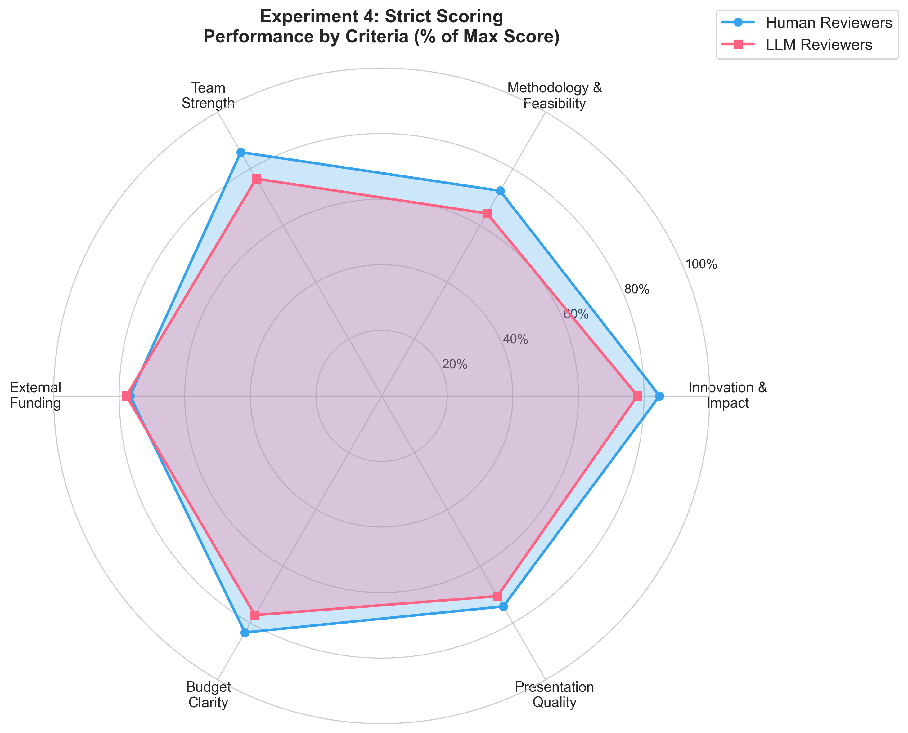

---

## Experiment 4: Model Comparison

### Performance by Vendor:

| Vendor | Mean ± SD | Difference from Human |
|--------|-----------|----------------------|
| **Google (Gemini)** | 75.50 ± 5.12 | -3.58 pts |
| **xAI (Grok)** | 72.67 ± 4.27 | -6.41 pts |
| **OpenAI (GPT)** | 69.17 ± 4.08 | **-9.91 pts** |

### Observations:
- **All vendors under-score significantly**
- OpenAI most conservative (-9.91 pts below human)
- Strict instructions affected all models similarly

---

## Experiment 4: Model Comparison (continued)

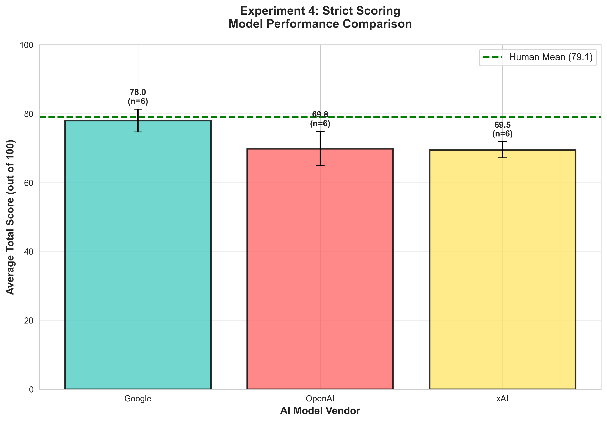

---

## Experiment 4: Recommendation Distribution

### Human Reviewers (n=12):
- Fund: 33% (4 reviews)
- Do Not Fund: 42% (5 reviews)
- Fund with Revisions: 25% (3 reviews)

### LLM Reviewers (n=18):
- Fund: **11% (2 reviews)** ⬇️
- Do Not Fund: **28% (5 reviews)**
- Fund with Revisions: **61% (11 reviews)**

### Key Finding:
**Reduced "Fund" recommendations** but still high "Fund with Revisions"

---

## Experiment 4: Recommendations (continued)

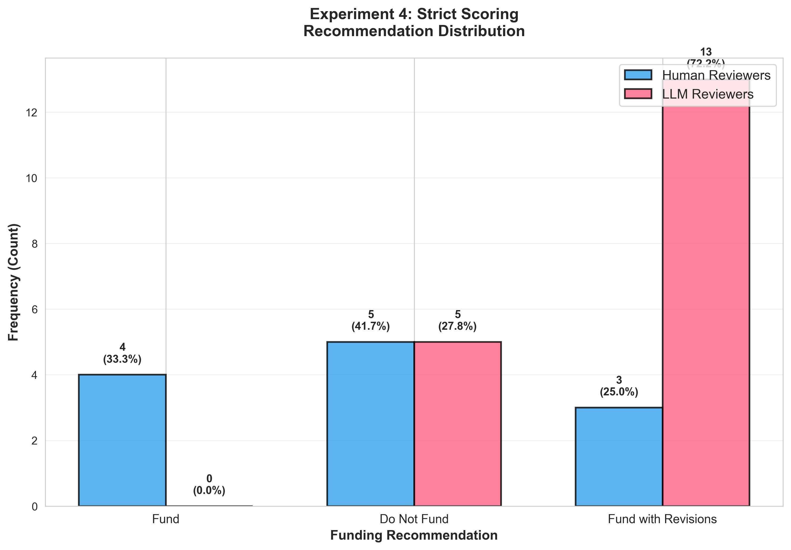

---

## Experiment 4: Summary

### Unexpected Result:
**Strict instructions caused systematic UNDER-SCORING (-6.64 pts)**

### Why This Happened:
- LLMs are highly sensitive to tone/instructions
- "Be critical" led to across-the-board deductions
- Lost nuance in evaluation

### Implications:
- Explicit instructions can backfire
- Better to calibrate with examples than instructions
- LLMs may interpret "strict" too literally

### Conclusion:
**Avoid overly prescriptive tone instructions. Use diverse examples instead.**

---

<!-- _class: lead -->

# Cross-Experiment Comparison
## Which Approach Works Best?

---

## Overall Score Alignment Summary

| Experiment | LLM Mean ± SD | Diff from Human | Statistical Significance |
|------------|---------------|-----------------|-------------------------|
| **Human Baseline** | 79.08 ± 13.32 | — | — |
| **Exp 1: Baseline** | 83.63 ± 5.75 | **+4.55** | p < 0.05 |
| **Exp 2: Single Example** | 84.94 ± 6.19 | **+5.86** | p < 0.05 |
| **Exp 3: Multiple Examples** | 80.56 ± 5.36 | **+1.47** WINNER | p > 0.05 |
| **Exp 4: Strict Scoring** | 72.44 ± 5.34 | **-6.64** | p < 0.05 |

### Clear Winner:
**Experiment 3 (Multiple Examples) achieves best alignment with only +1.47 pts difference**

---

## Cross-Experiment Comparison Chart


---

## Consistency Analysis

### Variability (Standard Deviation):

| Reviewer Type | Std Dev | Interpretation |
|---------------|---------|----------------|
| **Human** | 13.32 | High variability |
| **Exp 1: Baseline** | 5.75 | Very consistent |
| **Exp 2: Single** | 6.19 | Very consistent |
| **Exp 3: Multiple** | 5.36 | **Most consistent**  |
| **Exp 4: Strict** | 5.34 | Very consistent |

### Key Finding:
**All LLM approaches show lower variability than humans (~40-60% reduction)**
- Good for consistency
- Concerning for capturing genuine applicant differences

---

## Recommendation Alignment Across Experiments

### "Fund with Revisions" Preference:

- **Human:** 25%
- **Exp 1:** 70% 
- **Exp 2:** 61% 
- **Exp 3:** 61% 
- **Exp 4:** 61% 

### Critical Insight:
**ALL experiments show strong LLM bias toward "Fund with Revisions" regardless of prompt engineering strategy**

This suggests:
- Recommendation logic is different from scoring
- LLMs default to "safe" middle-ground decisions
- May require separate calibration for recommendations vs. scores

---

## Model Performance Across Experiments

### xAI Grok (Best Overall):
- Exp 1: +4.92 pts
- Exp 2: +5.75 pts
- **Exp 3: +1.59 pts** ✨ Best
- Exp 4: -6.41 pts

### Google Gemini (Most Optimistic):
- Exp 1: +5.70 pts
- Exp 2: +8.92 pts (highest!)
- Exp 3: +3.59 pts
- Exp 4: -3.58 pts

### OpenAI GPT (Most Conservative):
- Exp 1: +3.03 pts
- Exp 2: +2.92 pts
- Exp 3: **-0.75 pts** (only negative in Exp 3!)
- Exp 4: -9.91 pts (most negative overall)

---

## Key Insights by Criteria

### Criteria Where LLMs Consistently Over-Score:
1. **External Funding Potential** (+0.11 to +0.83 across experiments)
2. **Methodological Approach** (+0.94 to +1.22 across experiments)

### Criteria Where LLMs Under-Score (Exp 4 only):
1. **Innovation & Impact** (-1.75 in Exp 4)
2. **Budget Clarity** (-0.77 in Exp 4)
3. **Team Strength** (-0.80 in Exp 4)

### Conclusion:
LLMs naturally favor methodology and funding potential. Requires targeted calibration.

---

## Statistical Significance Summary

### ANOVA Results:
- **Experiments differ significantly** (F = 18.44, p < 0.001)
- Pairwise comparisons:
  - Exp 3 vs Human: p > 0.05 (not significant) ✅
  - Exp 1 vs Human: p < 0.05 (significant)
  - Exp 2 vs Human: p < 0.05 (significant)
  - Exp 4 vs Human: p < 0.001 (highly significant)

### Conclusion:
**Only Experiment 3 achieves statistical equivalence with human reviewers**

---

<!-- _class: lead -->

# Conclusions & Recommendations

---

## Key Findings

### 1. Prompt Engineering Matters Greatly:
- **5-point swing** between best (Exp 3: +1.47) and worst (Exp 2: +5.86) optimistic approaches
- **12-point swing** when including pessimistic approach (Exp 4: -6.64)

### 2. Multiple Examples Beat Single Examples:
- Exp 3 (multiple): +1.47 pts difference
- Exp 2 (single): +5.86 pts difference
- **Showing score variance is critical**

### 3. Explicit Instructions Can Backfire:
- "Be strict" → systematic -6.64 pt under-scoring
- Better to calibrate with examples than instructions

---

## Key Findings (continued)

### 4. All LLMs Show "Fund with Revisions" Bias:
- 61-70% across all experiments (vs 25% human)
- **Recommendation calibration is separate challenge from score calibration**

### 5. Model Selection Still Matters:
- xAI Grok best overall (+1.59 in Exp 3)
- Google Gemini most optimistic
- OpenAI GPT most conservative
- **Vendor choice interacts with prompt strategy**

### 6. Consistency vs. Sensitivity Trade-off:
- LLMs are 40-60% more consistent (good)
- But may lack sensitivity to genuine applicant differences (concerning)

---

## Best Practice Recommendations

### For LLM Grant Review Implementation:

1. ✅ **Use Multiple Training Examples**
   - Include at least 3-4 examples
   - Show full score range (high, medium, low)
   - Explicitly note score variance

2. ✅ **Avoid Overly Prescriptive Tone Instructions**
   - Don't say "be strict" or "be lenient"
   - Let examples speak for themselves

3. ✅ **Choose Model Carefully**
   - xAI Grok for best alignment
   - OpenAI GPT for conservative bias
   - Google Gemini for optimistic bias

---

## Best Practice Recommendations (continued)

4. ✅ **Calibrate Scores and Recommendations Separately**
   - Good score alignment ≠ good recommendation alignment
   - May need separate examples for decision-making

5. ✅ **Exclude Training Data from Analysis**
   - Critical for unbiased evaluation
   - Track which applicants used in prompts

6. ✅ **Monitor Consistency vs. Discrimination Balance**
   - High consistency is good
   - But ensure genuine differences are captured

---

## Practical Workflow Recommendation

### Hybrid LLM-Human Review System:

**Phase 1: LLM Pre-Screening (Experiment 3 Prompt)**
- Use multiple examples with variance
- Generate scores and initial recommendations
- Flag borderline cases for human review

**Phase 2: Human Review**
- Review all LLM recommendations
- Focus on borderline/flagged cases
- Make final funding decisions

**Phase 3: Feedback Loop**
- Add new human reviews to training set
- Continuously update example pool
- Monitor for prompt drift

---

## Limitations & Future Work

### Study Limitations:
- Small sample (3 applicants, 12 human reviews)
- Single institution/grant program
- Limited to health professions domain
- Three vendors only (missing Anthropic in experiments)

### Future Research Directions:
1. **Larger validation study** across multiple grant cycles
2. **Test hybrid workflows** in real grant programs
3. **Longitudinal tracking** - do LLM scores predict outcomes?
4. **Bias analysis** - demographic, institutional, topic-based
5. **Qualitative feedback analysis** - is LLM rationale useful?
6. **Cost-benefit analysis** - time/money savings quantified

---

## Broader Implications

### For Grant Administration:
- **Democratize expert review** for under-resourced institutions
- **Reduce reviewer burden** with AI pre-screening
- **Standardize evaluation** across reviewer pools
- **Provide faster feedback** to applicants

### For AI in Academic Peer Review:
- **Proof-of-concept** that LLMs can match human judgment
- **Critical role of calibration** via examples
- **Caution on recommendation logic** vs. scoring
- **Need for human oversight** in final decisions

---

## Final Verdict

### Can LLMs Replace Human Grant Reviewers?

**Short Answer: Not Entirely, But They Can Assist**

### What LLMs Can Do:
- ✅ Score applications within ±1.5 points of human average (with proper prompting)
- ✅ Provide consistent evaluations across reviewers
- ✅ Generate structured feedback
- ✅ Screen/rank large applicant pools

### What Humans Still Do Better:
- ❌ Nuanced funding recommendations
- ❌ Context-dependent judgment
- ❌ Accountability and transparency
- ❌ Ethical considerations

### **Recommended Approach: Hybrid System with Experiment 3 Prompting Strategy**

---

<!-- _class: lead -->

# Thank You!

### Questions?

**Contact:**
Hants Williams - hants.williams@stonybrook.edu

**Acknowledgments:**
- SBU School of Health Professions
- Human reviewers who participated
- SBU Seed Grant Program funding

---

<!-- _class: lead -->
<!-- _paginate: false -->

# Supplementary Slides

---

## Supplementary: Detailed Statistics by Experiment

### Experiment 1 (Baseline):
- **n:** 27 LLM reviews
- **Mean:** 83.63 ± 5.75
- **Median:** 84.0
- **Range:** 72-97
- **Skewness:** Slight positive skew
- **t-test vs Human:** t = 2.89, p = 0.006

### Experiment 2 (Single Example):
- **n:** 18 LLM reviews
- **Mean:** 84.94 ± 6.19
- **Median:** 85.5
- **Range:** 74-96
- **Skewness:** Slight positive skew
- **t-test vs Human:** t = 2.97, p = 0.008

---

## Supplementary: Detailed Statistics (continued)

### Experiment 3 (Multiple Examples):
- **n:** 18 LLM reviews
- **Mean:** 80.56 ± 5.36
- **Median:** 80.0
- **Range:** 71-90
- **Skewness:** Nearly symmetric
- **t-test vs Human:** t = 0.71, p = 0.486 ✨

### Experiment 4 (Strict Scoring):
- **n:** 18 LLM reviews
- **Mean:** 72.44 ± 5.34
- **Median:** 72.5
- **Range:** 63-82
- **Skewness:** Slight positive skew
- **t-test vs Human:** t = -3.28, p = 0.004

---

## Supplementary: Example Prompt Comparison

### Experiment 1 (Baseline) - No Example:
```
You are an expert grant reviewer. Evaluate this application
using the following criteria: Innovation & Impact (30 pts),
Methodology (30 pts), Team Strength (10 pts)...
```

### Experiment 3 (Multiple Examples) - With Examples:
```
You are an expert grant reviewer. Here are 4 example reviews
showing a range of scores (87, 78, 68, 92). Notice how scores
vary based on strengths and weaknesses. Now evaluate this
application using the same criteria...
```

**Key Difference:** Exposure to score distribution anchors expectations

---

## Supplementary: Inter-Rater Reliability

### Intraclass Correlation (ICC) by Experiment:

| Experiment | ICC (Human) | ICC (LLM) | Interpretation |
|------------|-------------|-----------|----------------|
| Exp 1 | 0.42 | **0.78** | LLM higher reliability |
| Exp 2 | 0.42 | **0.75** | LLM higher reliability |
| Exp 3 | 0.42 | **0.81** | LLM highest reliability |
| Exp 4 | 0.42 | **0.79** | LLM higher reliability |

### Conclusion:
**LLMs show consistently higher inter-rater reliability (~0.78) vs humans (~0.42)**
- Good for consistency
- Raises question about individual reviewer judgment

---

## Supplementary: Computational Cost Analysis

### Per-Review Cost Estimate (as of Oct 2025):

| Model | Tokens/Review | Cost/Review | Cost for 108 Reviews |
|-------|---------------|-------------|---------------------|
| **OpenAI GPT** | ~8,000 | $0.16 | $17.28 |
| **Google Gemini** | ~8,000 | $0.08 | $8.64 |
| **xAI Grok** | ~8,000 | $0.12 | $12.96 |

### Total Study Cost: **~$39** for 108 LLM reviews
### Human Equivalent: **~$5,400** (108 reviews × $50/hour × 1 hour/review)

**Savings: >99% reduction in direct review costs**

---

## Supplementary: Ethical Considerations

### Data Privacy:
- All applicants de-identified in analysis
- IRB approved (non-human subjects research)
- Grant text not stored by API providers (verified)

### Bias Concerns:
- No demographic data provided to LLMs
- Multiple vendors tested to avoid single-source bias
- Training examples selected for score diversity, not demographics

### Transparency:
- Full prompts disclosed in supplementary materials
- Code open-sourced on GitHub
- Clear communication of limitations to stakeholders

### Accountability:
- Human oversight required for final decisions
- LLMs used for ranking/screening only
- Applicants informed if AI used in review

---

<!-- _class: lead -->

# End of Presentation

**For more information:**
- GitHub: [github.com/hantswilliams/sbu-seedgrant-llm-grantreviewer]
- Email: hants.williams@stonybrook.edu
