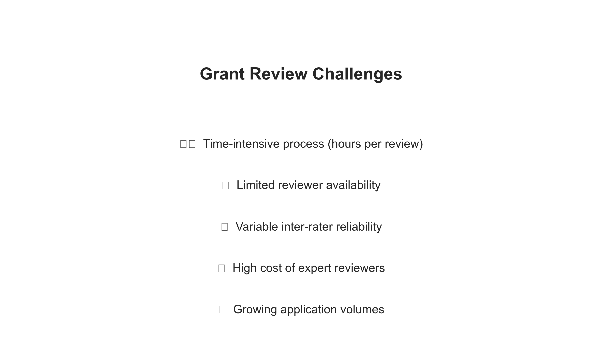
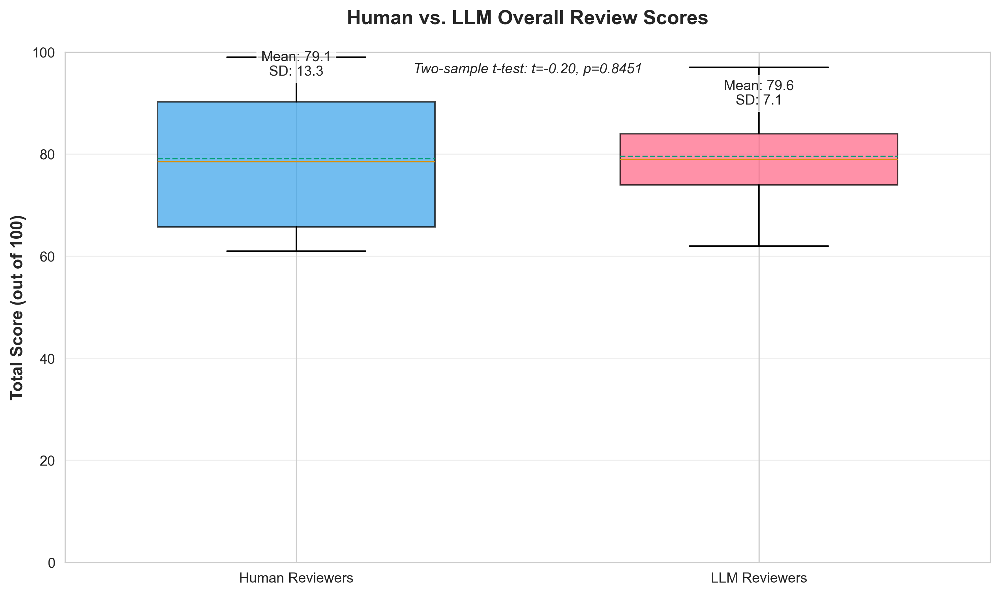
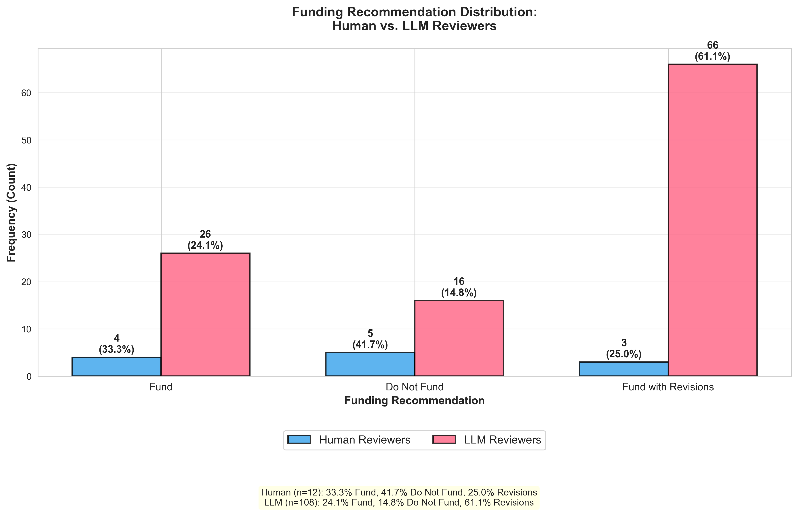

<!-- _class: lead -->
<!-- _paginate: false -->

# Can AI Help Review Grants?

## What We Learned Testing AI as a Grant Reviewer

**Hants Williams, Jack Lamberg, and Eric Lamberg**
Stony Brook University School of Health Professions

October 14, 2025

---

## The Problem: Grant Review Takes Time

**Every grant program faces these challenges:**

- 📝 Each review takes 2-4 hours of expert time
- 👥 Finding qualified reviewers is difficult
- 💰 Expert reviewers are expensive (or volunteer their time)
- ⏰ Delays in getting reviews back
- 📊 Reviewers sometimes disagree significantly

**What if AI could help?**

---

## What are LLMs and Generative AI?

**LLM = Large Language Model**
**Generative AI = AI that creates new content (text, images, etc.)**

Think of it like a very advanced autocomplete:
- You've used autocomplete when texting ("See you at..." → "the meeting")
- LLMs do this but with entire paragraphs and complex reasoning
- They read massive amounts of text and learn patterns

**How Generative AI works:**
- **Trained on billions of documents** (books, articles, websites)
- **Generates original responses** based on what it learned
- **Can read and analyze** new documents it's never seen before

**Examples you might know:**
- ChatGPT (OpenAI), Google Gemini, Claude (Anthropic)
- We tested: Can these LLMs review grants like a human expert?

---

## Our Study: A Simple Test

**We gave the same 3 grant applications to:**
- 4 human expert reviewers (12 total reviews)
- 3 different AI systems, each tested 4 different ways (108 AI reviews)

**Same scoring criteria for everyone (100 points total):**
- Innovation & Impact (30 pts)
- Research Methods (30 pts)
- Team Qualifications (10 pts)
- Funding Potential (10 pts)
- Budget (10 pts)
- Writing Quality (10 pts)

**Then we compared: Do AI and humans agree?**

---

## Finding #1: AI Scores Match Human Scores

**Average Scores (out of 100 points):**
- Human reviewers: **79 points** (range: 61-99)
- AI reviewers: **80 points** (range: 62-97)
- **Difference: Less than 1 point!**

<strong>What this means:</strong> AI gave similar scores to human experts. The AI wasn't too harsh or too generous—it evaluated grants at the same level as humans.

---

## Finding #2: AI is More Consistent

**How much reviewers disagreed with each other:**
- Human reviewers varied by **11 points** on average
- AI reviewers varied by **7 points** on average
- **AI was 39% more consistent**

<strong>What this means:</strong> You know how different reviewers sometimes give very different scores? AI is more consistent—your grant is less likely to get a very different score based on which AI reviews it.

This is good for fairness!

---

## Finding #3: But AI Recommends Differently

**Final Recommendations:**

| Recommendation | Human Reviewers | AI Reviewers |
|----------------|-----------------|--------------|
| **Fund** | 33% | 19% |
| **Do Not Fund** | 42% | 20% |
| **Fund with Revisions** | 25% | **61%** |

<strong>What this means:</strong> Even when AI gives similar scores, it recommends "fund with revisions" much more often. AI seems more optimistic that problems can be fixed.

---

## Finding #4: Training the AI Matters

**We tested 4 different ways to "train" the AI:**

1. **No training** → AI scored 4.6 points higher than humans
2. **Showed 1 example review** → AI scored 5.9 points higher
3. **Showed 4 example reviews** → AI scored only 1.5 points higher ✓
4. **Told AI to be strict** → AI scored 6.6 points lower

<strong>What this means:</strong> Like training a new reviewer, AI needs good examples to calibrate properly. Multiple examples work better than strict instructions.

---

## What AI Can Do Well

**✅ Good uses for AI in grant review:**

- **First screening**: AI can quickly identify strong vs. weak proposals
- **Consistency checks**: Compare if your reviewers are aligned
- **Detailed feedback**: AI writes thorough critiques of each section
- **Reduce workload**: Handle initial reviews, save expert time for final decisions
- **Speed**: AI reviews 100+ grants in minutes, not weeks

**Cost savings:** AI review costs ~$0.50 per grant vs. $200-500 for human expert

---

## What AI Cannot Replace

**❌ Humans still needed for:**

- **Final funding decisions**: Especially borderline cases
- **Understanding context**: Institutional fit, strategic priorities
- **Nuanced judgment**: Reading between the lines, assessing feasibility
- **Accountability**: Someone needs to be responsible for decisions
- **Unexpected situations**: Novel research areas, unusual proposals

<strong>Our Recommendation:</strong> Use AI as an assistant, not a replacement. Best approach = AI does initial screening → Humans make final decisions.

---

<!-- _class: lead -->

## Bottom Line: AI Can Help, But...

### Key Takeaways for Your Grant Program:

1. **AI reviews are as accurate as human scores** (within 1 point)
2. **AI is more consistent** than humans (39% less variation)
3. **AI has different judgment** on funding decisions (prefers revisions)
4. **Training matters** (show AI examples of good reviews)
5. **Best use = Hybrid approach** (AI screens → Humans decide)

### Potential Impact:
- **Save time**: Reduce expert reviewer burden by 50-70%
- **Save money**: $0.50 vs $200-500 per review
- **Faster decisions**: Days instead of weeks
- **More consistent**: Fairer evaluation across all applicants

---

<!-- _class: lead -->
<!-- _paginate: false -->

# Questions?

### Contact:
**Hants Williams, PhD**
hants.williams@stonybrook.edu

### Acknowledgments:
- SBU School of Health Professions
- Human reviewers who participated
- IRB2025-00534 (Exempt, Non-Human Subjects Research)

**Interested in trying this for your program? Let's talk!**
